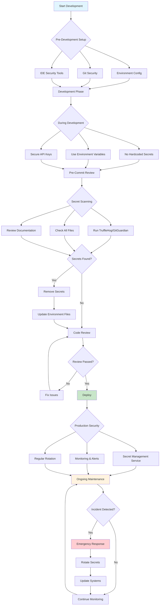

# Cursor Secrets Review Flow

## Key Review Points

### 1. **Pre-Development** (Blue)
- Environment configuration
- Git security setup
- IDE security tools

### 2. **Development** (White)
- No hardcoded secrets
- Environment variables only
- Secure API key management

### 3. **Pre-Commit** (White)
- Automated secret scanning
- Manual file review
- Documentation check

### 4. **Deployment** (Green)
- Production secret management
- Monitoring and alerts
- Regular rotation

### 5. **Maintenance** (Orange)
- Ongoing security monitoring
- Incident response
- Continuous improvement

### 6. **Emergency** (Red)
- Immediate secret rotation
- System updates
- Recovery procedures 