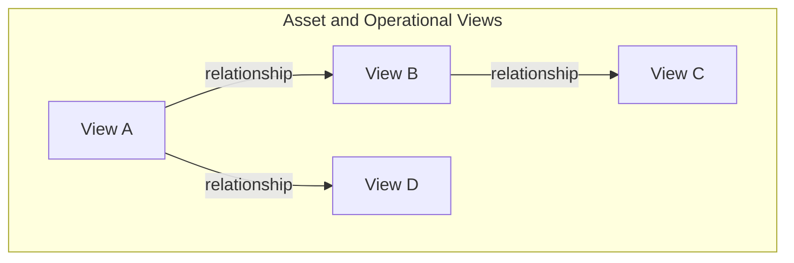

# Modern Data Model Overview Template

**Purpose of This Document:** This template is designed to capture domain knowledge from Subject-Matter Experts (SMEs) and translate it into a modern, graph-based data model for Cognite Data Fusion (CDF). The goal is to describe your operational world in plain English, focusing on the "things" that matter and how they relate to each other.

**Intended Audience:**
*   **Part 1:** The Subject-Matter Expert (SME) from the business or operational side. No technical data modeling expertise is required.
*   **Part 2:** The Solution Architect or an AI Assistant who will use the SME's input to design and implement the final data model in CDF.

**How to Use This Template:**
1.  **SME:** Fill out **Part 1** as completely as possible. Don't worry about perfect technical terms. Describe your world as you know it.
2.  **Architect/AI:** Use the information from Part 1 to populate **Part 2**, creating a concrete implementation plan for the Cognite Data Fusion data model.

---

## Part 1: Domain Knowledge Capture (To be completed by the Subject-Matter Expert)

### 1.1. High-Level Domain Overview

*Instructions: Briefly describe the business domain or operational system this data model will represent. What is the overall goal? What key questions will this data model help you answer?*

**(Example: "This model represents our wind farms. The goal is to monitor turbine health in real-time to predict failures and optimize power generation. We want to answer questions like 'Which turbines are most at risk of a gearbox failure in the next 3 months?' or 'What was the total power output of the 'Viking' farm last week?'")**

> **[Please write your domain overview here.]**

### 1.2. Core Objects & Concepts

*Instructions: List the most important physical or conceptual "things" in your domain. Think about physical assets, locations, conceptual items, events, and important documents. Don't worry about hierarchy yet, just list them.*

**(Examples: `Wind Turbine`, `Wind Farm`, `Substation`, `Gearbox`, `Blade`, `Inspection Report`, `Maintenance Work Order`, `Fault Alarm`, `Weather Forecast`)**

*   **[Object 1 Name]**
*   **[Object 2 Name]**
*   **[Object 3 Name]**
*   ... *(add as many as you need)*

### 1.3. Detailed Object Descriptions

*Instructions: For each object you listed in section 1.2, copy and paste the template below and fill it out. Be as detailed as you can.*

---
*(Copy this block for each object)*

#### **Object: `[Name of Your Object]`**

*   **Description:**
    > In plain English, what is this object? What is its primary role in your operations?

*   **Relationships to Other Objects:**
    > How does this object connect to others? Describe the relationship in a sentence. Think about physical containment (`is part of`), operational dependency (`sends power to`), or conceptual links (`is documented in`).
    > *(Examples: "A `Wind Turbine` **is located in** a `Wind Farm`." "A `Gearbox` **is a component of** a `Wind Turbine`." "An `Inspection Report` **describes the condition of** a `Wind Turbine`." "A `Maintenance Work Order` **was performed on** a `Gearbox`.")*
    >
    > *   Connects to `[Other Object Name]` as: [Describe the relationship]
    > *   Connects to `[Other Object Name]` as: [Describe the relationship]
    > *   ...

*   **Key Properties / Attributes:**
    > List the most important pieces of information or "specs" you need to know about this object.
    > *(Examples for a Wind Turbine: `Turbine ID`, `Manufacturer`, `Model Number`, `Installation Date`, `Rated Power (MW)`, `Hub Height (meters)`, `Status`)
    >
    > *   [Property 1]
    > *   [Property 2]
    > *   ...

*   **Associated Time-Series Data:**
    > What real-time or historical sensor measurements are important for this object?
    > *(Examples for a Wind Turbine: `Wind Speed`, `Power Output`, `Gearbox Temperature`, `Blade Pitch Angle`, `RPM`)
    >
    > *   [Time Series 1]
    > *   [Time Series 2]
    > *   ...

*   **Associated Documents or Events:**
    > Are there important documents (manuals, reports, diagrams) or events (inspections, failures, tests) associated with this object? List them here if you didn't list them as separate Core Objects already.
    > *(Examples: `Maintenance History`, `Engineering P&ID Diagram`, `Safety Certificate`)
    >
    > *   [Document/Event 1]
    > *   [Document/Event 2]
    > *   ...

---
*(End of copy block)*

---

## Part 2: Cognite Data Model Implementation Plan (To be completed by Solution Architect / AI)

*Instructions: Based on the SME input in Part 1, define the implementation strategy for the Cognite Data Fusion (CDF) data model. This section translates the business concepts into a technical GraphQL-based model.*

### 2.1. General Design Principles

*   **Dedicated Space**: The entire data model, including all views, containers, and data instances, will be located in a dedicated CDF space to ensure modularity and clear access control.
*   **Leverage the Cognite Core Data Model**: Whenever possible, objects representing physical assets or equipment will be modeled as views that implement the `CogniteAsset` concept. This provides standardization and allows for native linking to other CDF resource types like `CogniteTimeSeries`, `CogniteFile`, and `CogniteEvent`.
*   **Model Non-Asset Concepts**: Objects representing events (e.g., `Work Order`, `Well Test`) will implement `CogniteEvent`. Objects representing documents or structured data files (e.g., `Performance Curve`, `Report`) will implement `CogniteFile`.
*   **Graph-Based Relationships**: All relationships between objects will be modeled as **direct relationships** between views. This creates a true graph structure, enabling powerful, multi-hop queries essential for AI and advanced analytics. Hierarchy is established through these relationships, not rigid parent-child database structures.

### 2.2. Proposed Data Model Views and Relationships

<!-- The AI/Architect will generate the Mermaid diagram here based on the relationships described in Part 1. -->

### 2.3. View Implementation Details

*Instructions: For each conceptual object from Part 1, define its corresponding View in CDF.*

---
*(Copy this block for each object)*

#### **View: `[ViewName]`**

*   **Conceptual Object:** `[Name from Part 1]`
*   **Proposed Type:** `View` implementing `[CogniteAsset | CogniteEvent | CogniteFile | Custom Type]`
*   **Reasoning:**
    > [Explain *why* this CDF type was chosen. For example: "The SME described this as a physical piece of equipment with sensor data, making `CogniteAsset` the ideal choice for integration with time series and 3D models."]

*   **Key Properties:**
    > [List the properties that will be defined in the View, derived from the SME's input in section 1.3.]

*   **Direct Relationships:**
    > *   `[relationshipName]`: points to `[TargetViewName]` (1-to-1 / 1-to-Many / Many-to-Many)
    > *   ...

---
*(End of copy block)*

### 2.4. Summary of Benefits

This data model design provides:

*   **Graph-Native Structure**: Enables complex, multi-hop queries across the entire operational landscape (e.g., "Find all turbines made by 'Manufacturer X' that had a 'Gearbox Failure' event and show their maintenance history").
*   **Standardization**: Leverages the `CogniteCore` model for compatibility and integration with the full CDF feature set, including time series, events, files, and 3D models.
*   **Clarity and Extensibility**: Offers a logical and direct translation of the domain knowledge, which is easy to maintain and extend as business requirements evolve.
*   **AI-Optimized**: Creates a well-structured, contextualized knowledge graph, which is the ideal foundation for advanced analytics and AI applications, allowing them to easily traverse relationships and ground answers in authoritative data. 