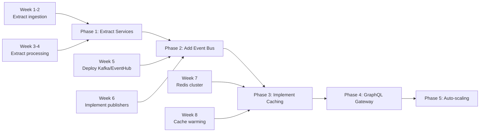

# AI Workflows

Concrete step-by-step workflows for common developer activities powered by AI
assistants. These proven patterns will accelerate your development process.

## 🎯 Workflow Categories

### CDF Operations Workflows

- **Asset Management**: Create, update, and query asset hierarchies
- **Time Series Operations**: Ingest, aggregate, and analyze time series data
- **Transformation Development**: Build efficient CDF transformations
- **Event Processing**: Handle equipment events and alarms

### Data Pipeline Workflows

- **Data Ingestion**: Import from source systems (SAP, PI, SCADA)
- **Data Quality**: Validate and cleanse industrial data
- **Data Modeling**: Design and implement CDF data models
- **Integration Patterns**: Connect CDF with external systems

### Analytics & Monitoring Workflows

- **KPI Calculation**: Compute OEE, MTBF, and other metrics
- **Anomaly Detection**: Identify equipment issues
- **Performance Analysis**: Optimize query and ingestion performance
- **Dashboard Development**: Create monitoring solutions

### Debugging & Optimization Workflows

- **CDF API Errors**: Diagnose and fix API issues
- **Performance Bottlenecks**: Identify slow queries and operations
- **Data Quality Issues**: Debug transformation failures
- **Authentication Problems**: Resolve access and permission errors

## 🚀 CDF Operations Workflows

### Asset Hierarchy Creation Workflow

**Context Setup**:

1. Open your `.cursor/rules.md` with CDF patterns
1. Have asset data model documentation open
1. Include example asset structures from your project

**Step-by-Step Process**:

#### Step 1: Analyze Source Data

```
Analyze this equipment list from SAP and design a CDF asset hierarchy:

[Paste CSV or JSON data]

Considerations:
- Identify parent-child relationships
- Determine asset types and metadata
- Plan for 50,000+ assets
- Handle missing relationships
```

#### Step 2: Generate Asset Creation Code

```
Based on the analysis, create a Python function that:
- Reads the source data
- Creates CDF assets with proper hierarchy
- Handles errors and missing parents
- Uses batch operations for performance
- Includes progress logging

Follow our CDF patterns:
- External IDs: {source}:{type}:{id}
- Include standard metadata fields
- Use exponential backoff for retries
```

**Complete Example - Asset Hierarchy Builder**:

```python
from cognite.client import CogniteClient
from cognite.client.data_classes import Asset
from typing import List, Dict
import pandas as pd
import logging

logger = logging.getLogger(__name__)

def build_asset_hierarchy(
    client: CogniteClient,
    equipment_data: pd.DataFrame,
    data_set_id: int
) -> Dict[str, Asset]:
    """Build asset hierarchy from equipment data.

    Args:
        client: CogniteClient instance
        equipment_data: DataFrame with columns: TAG, NAME, PARENT_TAG, TYPE
        data_set_id: Target dataset ID

    Returns:
        Dictionary of created assets by external_id
    """
    # Validate data
    required_cols = ['TAG', 'NAME', 'TYPE']
    missing = set(required_cols) - set(equipment_data.columns)
    if missing:
        raise ValueError(f"Missing columns: {missing}")

    # Create asset objects
    assets = []
    for _, row in equipment_data.iterrows():
        external_id = f"sap:equipment:{row['TAG']}"
        parent_id = f"sap:equipment:{row['PARENT_TAG']}" if pd.notna(row.get('PARENT_TAG')) else None

        asset = Asset(
            external_id=external_id,
            name=row['NAME'],
            parent_external_id=parent_id,
            data_set_id=data_set_id,
            metadata={
                'source': 'SAP',
                'equipmentType': row['TYPE'],
                'tag': row['TAG']
            }
        )
        assets.append(asset)

    # Sort for parent-child order
    assets = sort_by_hierarchy(assets)

    # Upload in batches
    created = {}
    batch_size = 1000

    for i in range(0, len(assets), batch_size):
        batch = assets[i:i+batch_size]
        logger.info(f"Uploading batch {i//batch_size + 1}")

        try:
            result = client.assets.create(batch)
            for asset in result:
                created[asset.external_id] = asset
        except Exception as e:
            logger.error(f"Batch failed: {e}")
            # Retry with exponential backoff
            created_batch = retry_batch_upload(client, batch, max_retries=3)
            created.update(created_batch)

    return created

def sort_by_hierarchy(assets: List[Asset]) -> List[Asset]:
    """Sort assets to ensure parents are created before children."""
    # Build dependency graph
    asset_map = {a.external_id: a for a in assets}
    sorted_assets = []
    visited = set()

    def add_with_parents(asset: Asset):
        if asset.external_id in visited:
            return
        visited.add(asset.external_id)

        # Add parent first if exists
        if asset.parent_external_id and asset.parent_external_id in asset_map:
            add_with_parents(asset_map[asset.parent_external_id])

        sorted_assets.append(asset)

    # Process all assets
    for asset in assets:
        add_with_parents(asset)

    return sorted_assets

def retry_batch_upload(
    client: CogniteClient,
    assets: List[Asset],
    max_retries: int = 3
) -> Dict[str, Asset]:
    """Upload assets with exponential backoff retry."""
    import time
    from cognite.client.exceptions import CogniteAPIError

    created = {}
    retry_delay = 1

    for attempt in range(max_retries):
        try:
            # Try smaller batches on retry
            batch_size = len(assets) // (attempt + 1) or 1

            for i in range(0, len(assets), batch_size):
                batch = assets[i:i+batch_size]
                result = client.assets.create(batch)
                for asset in result:
                    created[asset.external_id] = asset

            return created

        except CogniteAPIError as e:
            if attempt < max_retries - 1:
                logger.warning(f"Retry {attempt + 1}: {e}")
                time.sleep(retry_delay)
                retry_delay *= 2
            else:
                raise

    return created
```

#### Step 3: Handle Circular References

```
The asset creation is failing with circular reference errors.
Analyze the hierarchy and fix any circular dependencies:

- Detect cycles in parent-child relationships
- Log problematic assets
- Provide options to resolve (break cycle, create flat hierarchy)
```

**Circular Reference Detection**:

```python
def detect_circular_references(assets: List[Asset]) -> List[List[str]]:
    """Detect circular references in asset hierarchy."""
    from collections import defaultdict

    # Build adjacency list
    graph = defaultdict(list)
    for asset in assets:
        if asset.parent_external_id:
            graph[asset.parent_external_id].append(asset.external_id)

    # Find cycles using DFS
    cycles = []
    visited = set()
    rec_stack = set()

    def find_cycle(node, path):
        visited.add(node)
        rec_stack.add(node)
        path.append(node)

        for child in graph[node]:
            if child not in visited:
                if find_cycle(child, path):
                    return True
            elif child in rec_stack:
                # Found cycle
                cycle_start = path.index(child)
                cycles.append(path[cycle_start:] + [child])
                return True

        path.pop()
        rec_stack.remove(node)
        return False

    # Check all nodes
    for asset in assets:
        if asset.external_id not in visited:
            find_cycle(asset.external_id, [])

    return cycles
```

### Time Series Operations Workflow

**Context Setup**:

1. Open your `.cursor/rules.md` with CDF time series patterns
1. Have data quality requirements documented
1. Include aggregation and calculation patterns

**Step-by-Step Process**:

#### Step 1: Analyze Time Series Requirements

```
Analyze these sensor readings and design a time series ingestion strategy:

[Paste sample data with timestamps and values]

Requirements:
- Handle 10,000+ data points per minute
- Detect and handle gaps in data
- Apply data quality checks
- Calculate aggregates (hourly, daily)
- Handle late-arriving data
```

#### Step 2: Generate Ingestion Code

```
Create a Python function that:
- Ingests time series data efficiently
- Validates data quality (range, rate of change)
- Handles duplicate timestamps
- Uses batch operations
- Implements retry logic
- Calculates running aggregates
```

**Complete Example - Time Series Ingestion**:

```python
from cognite.client import CogniteClient
from cognite.client.data_classes import TimeSeries, Datapoints
from typing import List, Dict, Tuple
import pandas as pd
import numpy as np
from datetime import datetime, timedelta

class TimeSeriesProcessor:
    def __init__(self, client: CogniteClient, data_set_id: int):
        self.client = client
        self.data_set_id = data_set_id
        self.quality_limits = {
            'temperature': (-50, 150),  # Celsius
            'pressure': (0, 1000),      # kPa
            'flow': (0, 10000)          # m³/h
        }

    def ingest_sensor_data(
        self,
        sensor_data: pd.DataFrame,
        time_series_mapping: Dict[str, str]
    ) -> Dict[str, int]:
        """Ingest sensor data with quality checks.

        Args:
            sensor_data: DataFrame with timestamp and sensor columns
            time_series_mapping: Map sensor names to external IDs

        Returns:
            Dictionary of ingested point counts
        """
        results = {}

        for sensor, external_id in time_series_mapping.items():
            if sensor not in sensor_data.columns:
                continue

            # Extract and validate data
            data = sensor_data[['timestamp', sensor]].dropna()
            data = self._validate_quality(data, sensor)

            if data.empty:
                results[sensor] = 0
                continue

            # Convert to CDF format
            datapoints = Datapoints(
                external_id=external_id,
                timestamp=data['timestamp'].astype('int64') // 10**6,
                value=data[sensor].tolist()
            )

            # Ingest with retry
            try:
                self.client.datapoints.insert(
                    datapoints,
                    external_id=external_id
                )
                results[sensor] = len(data)
            except Exception as e:
                self._handle_ingestion_error(e, sensor, datapoints)
                results[sensor] = 0

        return results

    def _validate_quality(self, data: pd.DataFrame, sensor: str) -> pd.DataFrame:
        """Apply data quality checks."""
        if sensor not in self.quality_limits:
            return data

        min_val, max_val = self.quality_limits[sensor]
        col = data.columns[1]  # Value column

        # Range check
        valid_mask = (data[col] >= min_val) & (data[col] <= max_val)

        # Rate of change check
        if len(data) > 1:
            rate_of_change = data[col].diff().abs()
            threshold = (max_val - min_val) * 0.1  # 10% of range
            valid_mask &= (rate_of_change <= threshold) | rate_of_change.isna()

        invalid_count = (~valid_mask).sum()
        if invalid_count > 0:
            logger.warning(f"{sensor}: Filtered {invalid_count} invalid points")

        return data[valid_mask]

    def calculate_aggregates(
        self,
        external_id: str,
        start_time: datetime,
        end_time: datetime,
        granularity: str = '1h'
    ) -> pd.DataFrame:
        """Calculate aggregates for time series."""
        # Fetch raw data
        raw_data = self.client.datapoints.retrieve(
            external_id=external_id,
            start=start_time,
            end=end_time,
            aggregates=['average', 'min', 'max', 'count'],
            granularity=granularity
        )

        # Convert to DataFrame
        df = raw_data.to_pandas()

        # Add custom calculations
        if 'average' in df.columns and 'count' in df.columns:
            # Add data completeness metric
            expected_points = pd.Timedelta(granularity).total_seconds() / 60
            df['completeness'] = df['count'] / expected_points * 100

            # Add range
            if 'min' in df.columns and 'max' in df.columns:
                df['range'] = df['max'] - df['min']

        return df
```

#### Step 3: Handle Gaps and Late Data

```python
def handle_data_gaps(
    client: CogniteClient,
    external_id: str,
    expected_frequency: timedelta
) -> List[Tuple[datetime, datetime]]:
    """Detect and report gaps in time series data."""
    # Get latest data points
    end_time = datetime.now()
    start_time = end_time - timedelta(days=7)

    data = client.datapoints.retrieve(
        external_id=external_id,
        start=start_time,
        end=end_time
    )

    if not data:
        return [(start_time, end_time)]

    # Convert to pandas for gap detection
    df = data.to_pandas()
    df['time_diff'] = df.index.to_series().diff()

    # Find gaps larger than expected frequency
    gap_threshold = expected_frequency * 1.5
    gaps = df[df['time_diff'] > gap_threshold]

    gap_list = []
    for idx, row in gaps.iterrows():
        gap_start = df.index[df.index.get_loc(idx) - 1]
        gap_end = idx
        gap_list.append((gap_start, gap_end))

    return gap_list
```

### Data Transformation Workflow

**Context Setup**:

1. Open your `.cursor/rules.md` with CDF transformation patterns
1. Have source and target data models documented
1. Include SQL transformation templates

**Step-by-Step Process**:

#### Step 1: Design Transformation Logic

```
Design a CDF transformation that:
- Combines equipment data from RAW with maintenance records
- Calculates MTBF (Mean Time Between Failures)
- Updates asset metadata with reliability metrics
- Handles data quality issues

Source tables:
- equipment_master (asset information)
- maintenance_events (work orders)
- operational_data (runtime hours)

Target:
- Asset metadata updates with reliability KPIs
```

#### Step 2: Generate Transformation Code

```python
# CDF Transformation Configuration
transformation_config = {
    "name": "calculate_equipment_reliability",
    "external_id": "reliability_kpi_calculation",
    "destination": {
        "type": "assets"
    },
    "query": """
    WITH equipment_runtime AS (
        SELECT
            asset_id,
            SUM(runtime_hours) as total_runtime,
            MAX(timestamp) as last_update
        FROM operational_data
        WHERE timestamp > CURRENT_TIMESTAMP - INTERVAL '90 days'
        GROUP BY asset_id
    ),
    failure_events AS (
        SELECT
            asset_id,
            COUNT(*) as failure_count,
            AVG(EXTRACT(EPOCH FROM (lead(start_time) OVER
                (PARTITION BY asset_id ORDER BY start_time) - start_time))/3600)
                as avg_hours_between_failures
        FROM maintenance_events
        WHERE event_type = 'FAILURE'
            AND start_time > CURRENT_TIMESTAMP - INTERVAL '90 days'
        GROUP BY asset_id
    ),
    reliability_metrics AS (
        SELECT
            e.external_id,
            e.name,
            COALESCE(r.total_runtime, 0) as runtime_hours,
            COALESCE(f.failure_count, 0) as failures_90d,
            CASE
                WHEN f.failure_count > 0 THEN r.total_runtime / f.failure_count
                ELSE r.total_runtime
            END as mtbf_hours,
            CASE
                WHEN r.total_runtime > 0 THEN
                    (r.total_runtime - COALESCE(f.failure_count * 4, 0)) / r.total_runtime * 100
                ELSE 0
            END as availability_pct
        FROM equipment_master e
        LEFT JOIN equipment_runtime r ON e.id = r.asset_id
        LEFT JOIN failure_events f ON e.id = f.asset_id
    )
    SELECT
        external_id,
        name,
        json_build_object(
            'reliability_metrics', json_build_object(
                'mtbf_hours', ROUND(mtbf_hours, 2),
                'availability_percent', ROUND(availability_pct, 2),
                'failures_last_90d', failures_90d,
                'runtime_hours_90d', ROUND(runtime_hours, 2),
                'last_calculated', NOW()
            )
        ) as metadata
    FROM reliability_metrics
    WHERE runtime_hours > 0
    """
}

# Python wrapper for transformation management
from cognite.client import CogniteClient
from cognite.client.data_classes import Transformation
import logging

class TransformationManager:
    def __init__(self, client: CogniteClient):
        self.client = client
        self.logger = logging.getLogger(__name__)

    def deploy_transformation(self, config: dict) -> Transformation:
        """Deploy or update a transformation."""
        try:
            # Check if exists
            existing = self.client.transformations.retrieve(
                external_id=config['external_id']
            )

            if existing:
                # Update existing
                existing.query = config['query']
                existing.name = config['name']
                result = self.client.transformations.update(existing)
                self.logger.info(f"Updated transformation: {config['name']}")
            else:
                # Create new
                transformation = Transformation(
                    name=config['name'],
                    external_id=config['external_id'],
                    destination=config['destination'],
                    query=config['query'],
                    is_public=True,
                    ignore_null_fields=True
                )
                result = self.client.transformations.create(transformation)
                self.logger.info(f"Created transformation: {config['name']}")

            return result

        except Exception as e:
            self.logger.error(f"Transformation deployment failed: {e}")
            raise

    def monitor_transformation(self, external_id: str) -> dict:
        """Monitor transformation execution."""
        # Get transformation
        transformation = self.client.transformations.retrieve(
            external_id=external_id
        )

        # Get recent jobs
        jobs = self.client.transformations.jobs.list(
            transformation_external_id=external_id,
            limit=10
        )

        # Calculate metrics
        successful_jobs = [j for j in jobs if j.status == 'Completed']
        failed_jobs = [j for j in jobs if j.status == 'Failed']

        avg_duration = sum(
            (j.finished_time - j.started_time).total_seconds()
            for j in successful_jobs if j.finished_time
        ) / len(successful_jobs) if successful_jobs else 0

        return {
            'transformation_id': external_id,
            'total_jobs': len(jobs),
            'successful': len(successful_jobs),
            'failed': len(failed_jobs),
            'avg_duration_seconds': avg_duration,
            'last_run': jobs[0].started_time if jobs else None
        }
```

#### Step 3: Test and Validate

```python
def validate_transformation_results(
    client: CogniteClient,
    sample_asset_ids: List[str]
) -> Dict[str, bool]:
    """Validate transformation results."""
    validation_results = {}

    for asset_id in sample_asset_ids:
        try:
            # Retrieve updated asset
            asset = client.assets.retrieve(external_id=asset_id)

            # Check if metadata was updated
            if 'reliability_metrics' in asset.metadata:
                metrics = asset.metadata['reliability_metrics']

                # Validate metric values
                validations = [
                    metrics.get('mtbf_hours', 0) >= 0,
                    0 <= metrics.get('availability_percent', 0) <= 100,
                    metrics.get('failures_last_90d', 0) >= 0,
                    'last_calculated' in metrics
                ]

                validation_results[asset_id] = all(validations)
            else:
                validation_results[asset_id] = False

        except Exception as e:
            logger.error(f"Validation failed for {asset_id}: {e}")
            validation_results[asset_id] = False

    return validation_results
```

## 🔍 Debugging Workflows

### CDF API Error Analysis Workflow

**Context Setup**:

1. Open the file with the CDF API error
1. Include your CogniteClient configuration
1. Have API response and error details visible

**Prompt Structure**:

```
I'm getting this CDF API error: [paste error message]

Context:
- Operation: [what CDF operation]
- Error code: [HTTP status code]
- API endpoint: [endpoint being called]
- Data volume: [number of items]

The error occurs when: [describe when it happens]

I've tried: [list attempted solutions]

Please help me:
1. Identify the root cause
2. Suggest a fix with retry logic
3. Explain CDF limits involved
4. Suggest optimization strategies
```

**Real Example - CDF API Error**:

```
I'm getting this CDF API error: "CogniteAPIError: The number of items exceeds the maximum of 1000"

Context:
- Operation: assets.create()
- Error code: 400
- API endpoint: /api/v1/projects/{project}/assets
- Data volume: 5000 assets to create

The error occurs when: Trying to create all assets in a single API call

I've tried: Breaking into smaller lists but still getting timeout errors

Please help me:
1. Identify the root cause
2. Suggest a fix with retry logic
3. Explain CDF limits involved
4. Suggest optimization strategies
```

**Solution Generated**:

```python
from cognite.client import CogniteClient
from cognite.client.exceptions import CogniteAPIError
import time
from typing import List, TypeVar

T = TypeVar('T')

def batch_create_with_retry(
    client: CogniteClient,
    items: List[T],
    create_func,
    batch_size: int = 1000,
    max_retries: int = 3
) -> List[T]:
    """Create items in batches with retry logic.

    Handles:
    - CDF's 1000 item limit per request
    - Rate limiting (429 errors)
    - Timeout errors
    - Duplicate errors
    """
    created_items = []

    for i in range(0, len(items), batch_size):
        batch = items[i:i + batch_size]
        retry_count = 0

        while retry_count < max_retries:
            try:
                # Create batch
                result = create_func(batch)
                created_items.extend(result)

                # Log progress
                print(f"Created {len(created_items)}/{len(items)} items")
                break

            except CogniteAPIError as e:
                if e.code == 429:  # Rate limit
                    # Extract retry-after from headers
                    retry_after = int(e.headers.get('Retry-After', 60))
                    print(f"Rate limited. Waiting {retry_after}s...")
                    time.sleep(retry_after)

                elif e.code == 409:  # Duplicates
                    # Try with mode='upsert' if available
                    try:
                        result = create_func(batch, mode='upsert')
                        created_items.extend(result)
                        break
                    except:
                        # Filter out duplicates and retry
                        existing_ids = extract_duplicate_ids(e)
                        batch = [b for b in batch if b.external_id not in existing_ids]
                        if batch:
                            retry_count += 1
                            continue
                        else:
                            break

                elif e.code >= 500:  # Server errors
                    retry_count += 1
                    wait_time = 2 ** retry_count
                    print(f"Server error. Retry {retry_count}/{max_retries} in {wait_time}s")
                    time.sleep(wait_time)

                else:
                    # Non-retryable error
                    raise

            except Exception as e:
                print(f"Unexpected error: {e}")
                raise

        if retry_count >= max_retries:
            raise Exception(f"Failed to create batch after {max_retries} retries")

    return created_items

# Usage example
client = CogniteClient()
assets = [...]  # Your 5000 assets

created = batch_create_with_retry(
    client=client,
    items=assets,
    create_func=client.assets.create,
    batch_size=500  # Smaller batches for stability
)
```

### CDF Performance Debugging Workflow

**Context Setup**:

1. Open the slow CDF query or operation
1. Include data volumes and query patterns
1. Have CDF limits documentation visible

**Prompt Structure**:

```
I'm experiencing performance issues with CDF [operation type]:

Symptoms:
- Query taking [X] seconds for [Y] items
- [Timeout errors or slow responses]
- [Impact on application]

Current implementation:
- [Current query/operation code]
- Data volume: [number of assets/time series/data points]
- Frequency: [how often this runs]

Please help me:
1. Identify CDF-specific bottlenecks
2. Suggest query optimization
3. Provide parallel processing approach
4. Recommend caching strategies
```

**Real Example - Time Series Query Performance**:

```python
# SLOW: Sequential queries for multiple time series
def get_sensor_data_slow(client, sensor_ids, days=30):
    """This takes 45+ seconds for 100 sensors!"""
    end_time = datetime.now()
    start_time = end_time - timedelta(days=days)

    all_data = {}
    for sensor_id in sensor_ids:
        data = client.datapoints.retrieve(
            external_id=sensor_id,
            start=start_time,
            end=end_time,
            aggregates=['average'],
            granularity='1h'
        )
        all_data[sensor_id] = data.to_pandas()

    return all_data

# OPTIMIZED: Parallel retrieval with batching
from concurrent.futures import ThreadPoolExecutor
import asyncio

def get_sensor_data_optimized(client, sensor_ids, days=30):
    """Optimized version - 3-5 seconds for 100 sensors"""
    end_time = datetime.now()
    start_time = end_time - timedelta(days=days)

    def fetch_batch(batch_ids):
        # Retrieve multiple time series in one call
        return client.datapoints.retrieve_multiple(
            external_ids=batch_ids,
            start=start_time,
            end=end_time,
            aggregates=['average'],
            granularity='1h',
            limit=100000  # Ensure we get all points
        )

    # Split into optimal batch sizes
    batch_size = 20  # CDF performs well with 20-50 IDs per call
    batches = [sensor_ids[i:i+batch_size] for i in range(0, len(sensor_ids), batch_size)]

    # Parallel execution
    with ThreadPoolExecutor(max_workers=10) as executor:
        results = list(executor.map(fetch_batch, batches))

    # Combine results
    all_data = {}
    for batch_result in results:
        for ts in batch_result:
            all_data[ts.external_id] = ts.to_pandas()

    return all_data

# ADVANCED: With caching and incremental updates
class CachedTimeSeriesReader:
    def __init__(self, client: CogniteClient, cache_dir: str = '.cache'):
        self.client = client
        self.cache_dir = Path(cache_dir)
        self.cache_dir.mkdir(exist_ok=True)

    def get_sensor_data_cached(self, sensor_ids, days=30):
        """Ultra-fast with caching - <1 second for cached data"""
        end_time = datetime.now()
        all_data = {}

        # Group by cache status
        to_fetch = []

        for sensor_id in sensor_ids:
            cache_file = self.cache_dir / f"{sensor_id}_{days}d.parquet"

            if cache_file.exists():
                # Check cache age
                cache_age = datetime.now() - datetime.fromtimestamp(cache_file.stat().st_mtime)

                if cache_age < timedelta(hours=1):
                    # Use cache
                    all_data[sensor_id] = pd.read_parquet(cache_file)
                else:
                    # Fetch only new data
                    cached_data = pd.read_parquet(cache_file)
                    last_timestamp = cached_data.index[-1]

                    new_data = self.client.datapoints.retrieve(
                        external_id=sensor_id,
                        start=last_timestamp,
                        end=end_time,
                        aggregates=['average'],
                        granularity='1h'
                    ).to_pandas()

                    # Combine and save
                    combined = pd.concat([cached_data, new_data]).drop_duplicates()
                    combined.to_parquet(cache_file)
                    all_data[sensor_id] = combined
            else:
                to_fetch.append(sensor_id)

        # Fetch missing data in parallel
        if to_fetch:
            fresh_data = get_sensor_data_optimized(self.client, to_fetch, days)

            # Cache the fresh data
            for sensor_id, data in fresh_data.items():
                cache_file = self.cache_dir / f"{sensor_id}_{days}d.parquet"
                data.to_parquet(cache_file)
                all_data[sensor_id] = data

        return all_data
```

## 🔧 Refactoring Workflows

### CDF Code Modernization Workflow

**Context Setup**:

1. Open legacy CDF integration code
1. Include latest SDK documentation
1. Have modern patterns and best practices visible

**Prompt Structure**:

```
Refactor this legacy CDF code to use modern patterns:

Current issues:
- Using deprecated SDK methods
- No error handling or retries
- Sequential operations (slow)
- Hard-coded credentials

Goals:
- Migrate to latest SDK version
- Add proper error handling
- Implement parallel operations
- Use environment-based config

Constraints:
- Must maintain backward compatibility
- Zero downtime migration
- Preserve existing external IDs

Please provide:
1. Modernized code with migration steps
2. Performance comparison
3. Risk mitigation strategies
4. Rollback plan
```

**Before/After Example - Legacy to Modern CDF Code**:

**BEFORE (Legacy Code)**:

```python
# Old style - CDF SDK v1.x patterns
from cognite import CogniteClient

class OldDataIngestion:
    def __init__(self):
        # Hard-coded credentials - BAD!
        self.client = CogniteClient(
            api_key="<hardcoded-key>",
            project="my-project",
            base_url="https://api.cognitedata.com"
        )

    def upload_timeseries(self, data):
        """Sequential upload with no error handling"""
        for row in data:
            try:
                # Deprecated method
                self.client.datapoints.post_multi_time_series_datapoints([
                    {
                        "name": row["name"],
                        "datapoints": [{
                            "timestamp": row["timestamp"],
                            "value": row["value"]
                        }]
                    }
                ])
            except:
                # Silent failure - BAD!
                pass

    def get_assets(self, asset_ids):
        """No pagination, will fail with large lists"""
        assets = []
        for asset_id in asset_ids:
            asset = self.client.assets.get_asset(asset_id)
            assets.append(asset)
        return assets
```

**AFTER (Modern Code)**:

```python
# Modern style - CDF SDK v6.x patterns
from cognite.client import CogniteClient, ClientConfig
from cognite.client.credentials import OAuthClientCredentials
from cognite.client.data_classes import Datapoints, DatapointsList
from cognite.client.exceptions import CogniteAPIError
import os
from typing import List, Dict
import logging
from concurrent.futures import ThreadPoolExecutor
import backoff

logger = logging.getLogger(__name__)

class ModernDataIngestion:
    def __init__(self):
        # Environment-based configuration
        self.client = CogniteClient(
            ClientConfig(
                client_name="DataIngestion/2.0",
                project=os.getenv("CDF_PROJECT"),
                credentials=OAuthClientCredentials(
                    token_url=os.getenv("CDF_TOKEN_URL"),
                    client_id=os.getenv("CDF_CLIENT_ID"),
                    client_secret=os.getenv("CDF_CLIENT_SECRET"),
                    scopes=["https://greenfield.cognitedata.com/.default"]
                ),
                max_workers=10  # Connection pooling
            )
        )

    @backoff.on_exception(
        backoff.expo,
        CogniteAPIError,
        max_tries=3,
        giveup=lambda e: e.code not in [429, 500, 502, 503]
    )
    def upload_timeseries(self, data: List[Dict]) -> DatapointsList:
        """Batch upload with retry logic and error handling"""
        # Group by external_id for efficient upload
        grouped_data = {}
        for row in data:
            ext_id = row["external_id"]
            if ext_id not in grouped_data:
                grouped_data[ext_id] = []
            grouped_data[ext_id].append({
                "timestamp": row["timestamp"],
                "value": row["value"]
            })

        # Create Datapoints objects
        datapoints_list = []
        for ext_id, points in grouped_data.items():
            dp = Datapoints(
                external_id=ext_id,
                timestamp=[p["timestamp"] for p in points],
                value=[p["value"] for p in points]
            )
            datapoints_list.append(dp)

        # Batch upload with progress tracking
        batch_size = 100000  # Points per request
        uploaded = DatapointsList([])

        for i in range(0, len(datapoints_list), 10):  # 10 time series per request
            batch = datapoints_list[i:i+10]
            try:
                result = self.client.datapoints.insert_multiple(batch)
                uploaded.extend(result)
                logger.info(f"Uploaded batch {i//10 + 1}, total points: {sum(len(dp) for dp in batch)}")
            except CogniteAPIError as e:
                logger.error(f"Failed to upload batch: {e.message}")
                # Could implement dead letter queue here
                raise

        return uploaded

    def get_assets(self, external_ids: List[str]) -> List[Asset]:
        """Parallel retrieval with automatic batching"""
        # Use retrieve_multiple for efficiency
        try:
            # Handles pagination automatically
            assets = self.client.assets.retrieve_multiple(
                external_ids=external_ids,
                ignore_unknown_ids=True  # Don't fail on missing assets
            )

            # Log missing assets
            found_ids = {a.external_id for a in assets}
            missing_ids = set(external_ids) - found_ids
            if missing_ids:
                logger.warning(f"Assets not found: {missing_ids}")

            return assets

        except CogniteAPIError as e:
            logger.error(f"Failed to retrieve assets: {e}")
            # Fallback to chunked retrieval
            return self._get_assets_chunked(external_ids)

    def _get_assets_chunked(self, external_ids: List[str]) -> List[Asset]:
        """Fallback method with chunking for large requests"""
        chunk_size = 100
        all_assets = []

        with ThreadPoolExecutor(max_workers=5) as executor:
            chunks = [external_ids[i:i+chunk_size] for i in range(0, len(external_ids), chunk_size)]
            results = executor.map(
                lambda chunk: self.client.assets.retrieve_multiple(external_ids=chunk, ignore_unknown_ids=True),
                chunks
            )

            for asset_list in results:
                all_assets.extend(asset_list)

        return all_assets

# Migration wrapper for backward compatibility
class MigrationWrapper:
    """Provides old interface while using new implementation"""
    def __init__(self):
        self.modern = ModernDataIngestion()
        self.legacy_mapping = {}  # Map old IDs to external_ids

    def post_multi_time_series_datapoints(self, data):
        """Legacy method wrapper"""
        # Transform to modern format
        modern_data = []
        for ts in data:
            name = ts["name"]
            # Map name to external_id (implement your mapping logic)
            external_id = self.legacy_mapping.get(name, f"ts_{name}")

            for dp in ts["datapoints"]:
                modern_data.append({
                    "external_id": external_id,
                    "timestamp": dp["timestamp"],
                    "value": dp["value"]
                })

        return self.modern.upload_timeseries(modern_data)
```

**Migration Steps**:

```python
# Step 1: Deploy new code alongside old
# Step 2: Route small % of traffic to new code
# Step 3: Monitor metrics (errors, latency)
# Step 4: Gradually increase traffic %
# Step 5: Full migration

# Rollback plan
if error_rate > 0.01:  # 1% error threshold
    switch_to_legacy()
    alert_on_call_engineer()
```

### CDF Architecture Evolution Workflow

**Context Setup**:

1. Open current CDF integration architecture
1. Include data flow diagrams and models
1. Have CDF best practices documentation visible

**Prompt Structure**:

```
Evolve our CDF architecture from [current state] to [target state]:

Current architecture:
- Monolithic data pipeline
- Direct API calls from applications
- No caching or event handling
- Manual scaling

Target architecture:
- Event-driven microservices
- GraphQL API gateway
- Multi-tier caching
- Auto-scaling transformations

Constraints:
- 10TB existing data
- 1000 requests/second peak
- 99.9% uptime requirement
- Multi-region deployment

Please provide:
1. Architecture design with diagrams
2. Component specifications
3. Migration phases
4. Risk assessment
```

**Example: From Monolith to Event-Driven CDF Architecture**:

```python
# BEFORE: Monolithic Pipeline
class MonolithicPipeline:
    """All logic in one place - hard to scale and maintain"""
    def process_all_data(self):
        # 1. Read from source systems
        sap_data = self.read_sap()
        pi_data = self.read_pi()
        scada_data = self.read_scada()

        # 2. Transform everything
        assets = self.create_assets(sap_data)
        timeseries = self.create_timeseries(pi_data)
        events = self.create_events(scada_data)

        # 3. Upload to CDF
        self.client.assets.create(assets)
        self.client.time_series.create(timeseries)
        self.client.events.create(events)

        # 4. Calculate KPIs
        self.calculate_all_kpis()

# AFTER: Event-Driven Microservices
# Service 1: Data Ingestion Service
class IngestionService:
    """Handles data ingestion with event publishing"""
    def __init__(self, client: CogniteClient, event_hub):
        self.client = client
        self.event_hub = event_hub

    async def ingest_sap_data(self, data):
        """Ingest and publish events"""
        # Validate and transform
        assets = self.transform_to_assets(data)

        # Upload to RAW
        self.client.raw.rows.insert(
            db_name="staging",
            table_name="sap_equipment",
            rows=data
        )

        # Publish event for downstream processing
        await self.event_hub.publish({
            "type": "assets.ingested",
            "source": "sap",
            "count": len(assets),
            "timestamp": datetime.now().isoformat()
        })

# Service 2: Asset Management Service
class AssetService:
    """Manages asset lifecycle with caching"""
    def __init__(self, client: CogniteClient, cache: Redis):
        self.client = client
        self.cache = cache

    @event_handler("assets.ingested")
    async def process_new_assets(self, event):
        """React to asset ingestion events"""
        # Read from staging
        raw_data = self.client.raw.rows.list(
            db_name="staging",
            table_name=f"{event['source']}_equipment"
        )

        # Transform and enrich
        assets = self.enrich_assets(raw_data)

        # Create with deduplication
        created = self.client.assets.create(assets, mode="upsert")

        # Update cache
        for asset in created:
            self.cache.set(
                f"asset:{asset.external_id}",
                asset.dump(),
                ex=3600
            )

        # Publish completion event
        await self.event_hub.publish({
            "type": "assets.created",
            "count": len(created),
            "external_ids": [a.external_id for a in created]
        })

# Service 3: KPI Calculation Service
class KPIService:
    """Calculates KPIs based on events"""

    @event_handler(["assets.created", "timeseries.updated"])
    async def calculate_kpis(self, event):
        """Trigger KPI calculations on relevant events"""
        if event["type"] == "assets.created":
            # Calculate asset utilization
            for asset_id in event["external_ids"]:
                await self.calculate_asset_utilization(asset_id)

        elif event["type"] == "timeseries.updated":
            # Calculate OEE
            await self.calculate_oee(event["timeseries_ids"])

# Service 4: GraphQL Gateway
from strawberry import Schema, type, field

@type
class Asset:
    external_id: str
    name: str
    metadata: dict

    @field
    async def latest_oee(self) -> float:
        """Resolve OEE from cache or calculate"""
        # Check cache first
        cached = await cache.get(f"oee:{self.external_id}")
        if cached:
            return float(cached)

        # Calculate if not cached
        return await kpi_service.calculate_oee(self.external_id)

@type
class Query:
    @field
    async def assets(
        self,
        filter: Optional[AssetFilter] = None,
        limit: int = 100
    ) -> List[Asset]:
        """Query assets with caching and filtering"""
        # Implementation with DataLoader pattern
        return await asset_loader.load_many(filter, limit)

schema = Schema(query=Query)

# Infrastructure as Code
# terraform/main.tf
resource "cognite_transformation" "asset_enrichment" {
  name        = "asset_enrichment"
  query       = file("sql/enrich_assets.sql")
  destination = {
    type = "assets"
  }
  schedule = {
    interval = "*/15 * * * *"  # Every 15 minutes
  }

  notifications = [{
    destination = "https://api.events.com/webhook"
    type        = "webhook"
  }]
}

resource "cognite_data_set" "operational_data" {
  name         = "Operational Data"
  description  = "Real-time operational data"
  external_id  = "dataset:operational"
}
```

**Migration Phases**:



## 🧪 Testing Workflows

### CDF Integration Testing Workflow

**Context Setup**:

1. Open your CDF integration code
1. Include test fixtures and mock data
1. Have CDF SDK testing utilities visible

**Step-by-Step Process**:

#### Step 1: Generate Test Fixtures

```
Create test fixtures for this CDF integration:
- Asset hierarchy with 1000+ assets
- Time series with realistic data patterns
- Events with various types and subtypes
- Include edge cases (missing data, duplicates)
```

**Generated Test Framework**:

```python
import pytest
from unittest.mock import Mock, patch
from cognite.client import CogniteClient
from cognite.client.data_classes import Asset, TimeSeries, Event, AssetList
from cognite.client.testing import monkeypatch_cognite_client
import pandas as pd
import numpy as np
from datetime import datetime, timedelta

class CogniteTestFixtures:
    """Reusable test fixtures for CDF integrations"""

    @staticmethod
    def generate_asset_hierarchy(size=1000, depth=4):
        """Generate realistic asset hierarchy"""
        assets = []

        # Create root assets
        plants = [
            Asset(
                external_id=f"plant_{i}",
                name=f"Plant {i}",
                metadata={"type": "plant", "location": f"Location {i}"}
            )
            for i in range(size // 100)
        ]
        assets.extend(plants)

        # Create equipment hierarchy
        for plant in plants:
            for j in range(10):  # Units per plant
                unit = Asset(
                    external_id=f"{plant.external_id}_unit_{j}",
                    name=f"Unit {j}",
                    parent_external_id=plant.external_id,
                    metadata={"type": "unit"}
                )
                assets.append(unit)

                for k in range(10):  # Equipment per unit
                    equipment = Asset(
                        external_id=f"{unit.external_id}_equipment_{k}",
                        name=f"Equipment {k}",
                        parent_external_id=unit.external_id,
                        metadata={
                            "type": "equipment",
                            "criticality": np.random.choice(["high", "medium", "low"])
                        }
                    )
                    assets.append(equipment)

        return assets[:size]
```

## 📖 Documentation Workflows

### CDF Solution Documentation Workflow

**Context Setup**:

1. Open your CDF solution architecture
1. Include data models and API specifications
1. Have existing documentation templates visible

**Step-by-Step Process**:

#### Step 1: Generate Architecture Documentation

```
Document this CDF solution architecture:
- Asset hierarchy design decisions
- Data flow from source systems to CDF
- Transformation logic and business rules
- API endpoints and usage patterns
- Performance considerations
- Security and access control

Include:
- Mermaid diagrams for visual representation
- Code examples for key operations
- Configuration templates
```

**Generated Documentation Example**:

````markdown
# Equipment Monitoring Solution

## Architecture Overview

This solution provides real-time equipment monitoring and predictive maintenance capabilities using Cognite Data Fusion.

### System Architecture

```mermaid
graph TB
    subgraph "Source Systems"
        SAP[SAP PM]
        PI[OSIsoft PI]
        SCADA[SCADA Systems]
    end

    subgraph "CDF Core"
        RAW[RAW Database]
        ASSETS[Asset Hierarchy]
        TS[Time Series]
        EVENTS[Events & Alarms]
    end

    subgraph "Processing"
        TRANS[Transformations]
        FUNCS[CDF Functions]
        ML[ML Models]
    end

    subgraph "Applications"
        DASH[Monitoring Dashboard]
        MOBILE[InField App]
        API[GraphQL API]
    end

    SAP --> RAW
    PI --> TS
    SCADA --> EVENTS

    RAW --> TRANS
    TRANS --> ASSETS

    ASSETS --> FUNCS
    TS --> FUNCS
    EVENTS --> FUNCS

    FUNCS --> ML

    ASSETS --> API
    TS --> API
    ML --> API

    API --> DASH
    API --> MOBILE
````

### Data Model

#### Asset Hierarchy

The asset hierarchy follows ISA-95 standards with the following structure:

- **Enterprise**: Company level
- **Site**: Physical locations
- **Area**: Functional areas within sites
- **Unit**: Process units
- **Equipment**: Individual equipment items

```python
# Asset creation example
from cognite.client import CogniteClient
from cognite.client.data_classes import Asset

client = CogniteClient()

# Create a pump asset
pump = Asset(
    external_id="pump_P-101",
    name="Centrifugal Pump P-101",
    parent_external_id="unit_U-100",
    metadata={
        "type": "pump",
        "manufacturer": "Sulzer",
        "model": "CPT 31-50",
        "installation_date": "2020-05-15",
        "criticality": "high"
    },
    description="Main feed pump for reactor R-101"
)

client.assets.create(pump)
```

### Time Series Structure

| External ID | Name | Unit | Description |
|------------|------|------|-------------| | `ts_P-101_flow` | Flow Rate | m³/h
| Pump discharge flow rate | | `ts_P-101_pressure` | Discharge Pressure | bar |
Pump discharge pressure | | `ts_P-101_temperature` | Temperature | °C | Pump
casing temperature | | `ts_P-101_vibration` | Vibration | mm/s | Pump vibration
velocity |

### API Usage

#### Authentication

```python
from cognite.client import CogniteClient, ClientConfig
from cognite.client.credentials import OAuthClientCredentials

creds = OAuthClientCredentials(
    token_url="https://login.microsoftonline.com/{tenant}/oauth2/v2.0/token",
    client_id="your-client-id",
    client_secret="your-secret",
    scopes=["https://greenfield.cognitedata.com/.default"]
)

client = CogniteClient(
    ClientConfig(
        client_name="EquipmentMonitoring/1.0",
        project="your-project",
        credentials=creds
    )
)
```

### Performance Guidelines

1. **Batch Operations**: Always use batch operations for multiple items
1. **Pagination**: Handle large result sets with proper pagination
1. **Caching**: Implement caching for frequently accessed data
1. **Parallel Processing**: Use concurrent requests for independent operations

### Monitoring and Alerting

The solution includes automated monitoring for:

- Data ingestion delays > 5 minutes
- Failed transformations
- API error rates > 1%
- Query response times > 2 seconds

````

#### Step 2: Generate API Documentation
```python
# OpenAPI Specification Generator
from typing import List, Optional
from pydantic import BaseModel, Field
from fastapi import FastAPI, HTTPException

app = FastAPI(
    title="Equipment Monitoring API",
    description="API for equipment monitoring and analytics",
    version="1.0.0"
)

class EquipmentStatus(BaseModel):
    """Equipment status response model"""
    external_id: str = Field(..., description="Equipment external ID")
    name: str = Field(..., description="Equipment name")
    status: str = Field(..., description="Current status: running, stopped, maintenance")
    health_score: float = Field(..., description="Health score 0-100")
    last_maintenance: Optional[str] = Field(None, description="Last maintenance date")
    alerts: List[str] = Field(default_factory=list, description="Active alerts")

@app.get(
    "/equipment/{external_id}/status",
    response_model=EquipmentStatus,
    summary="Get equipment status",
    description="Retrieve current status and health score for equipment"
)
async def get_equipment_status(external_id: str) -> EquipmentStatus:
    """Get real-time equipment status including health score and active alerts."""
    # Implementation here
    pass
````

## 📊 Workflow Best Practices

### Preparation

1. **Gather Context**: Open relevant files and documentation
1. **Define Scope**: Be clear about what you want to achieve
1. **Set Constraints**: Specify limitations and requirements
1. **Prepare Examples**: Have good examples visible for reference

### Execution

1. **Start Simple**: Begin with basic requirements
1. **Iterate**: Refine based on AI outputs
1. **Validate**: Test generated code thoroughly
1. **Document**: Record successful patterns for reuse

### Follow-up

1. **Review**: Analyze what worked and what didn't
1. **Refine**: Update your context based on results
1. **Share**: Document successful workflows for your team
1. **Improve**: Continuously enhance your workflow patterns

## 🎯 Workflow Templates

### Quick Component Template

```
Create a [component type] for [purpose]:
- Props: [list props]
- Features: [list features]
- Styling: [styling approach]
- Follow patterns from [reference component]
```

### Debug Template

```
Error: [error message]
Context: [relevant files and code]
Attempted: [what you've tried]
Help: [specific assistance needed]
```

### Refactor Template

```
Refactor [target] to improve [aspects]:
- Issues: [current problems]
- Goals: [desired outcomes]
- Constraints: [limitations]
- Provide: [what you need]
```

## 📖 Next Steps

- **[Context Engineering](../context_engineering.md)** - Learn to provide
  effective context for workflows
- **[Advanced Prompting](../advanced_prompting.md)** - Master sophisticated
  techniques for complex workflows
- **[Production Templates](../../cdf_project/ai_playbooks/01_PROJECT_LEVEL_UPDATE.md)**
  \- Apply workflows to CDF development

## 🚀 Getting Started

1. **Choose a Workflow**: Start with a simple code generation workflow
1. **Prepare Context**: Set up your `.cursor/rules.md` and open relevant files
1. **Follow the Template**: Use the provided prompt structures
1. **Iterate and Improve**: Refine based on results
1. **Document Success**: Record what works for your team

______________________________________________________________________

**Ready to accelerate your development?** Start with a
**[Code Generation Workflow](#quick-component-template)** and build from there.
