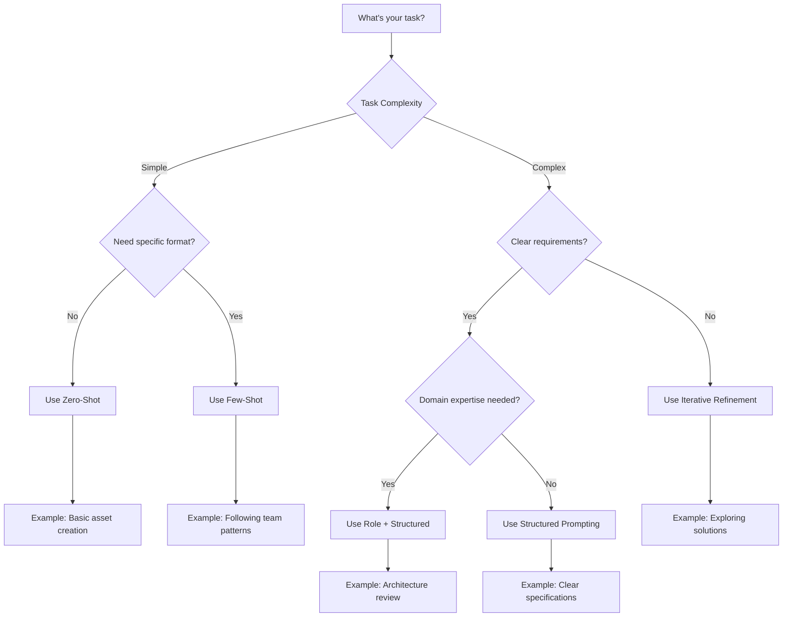

# Prompt Techniques Overview

Master foundational prompting styles that form the building blocks of effective AI-assisted development.

## 🎯 Foundational Techniques

These core techniques provide the foundation for all advanced prompting. Master these before moving to sophisticated methods.

### Interactive Example: Try It Yourself!

```
💡 Quick Exercise: Choose a technique and practice with these CDF tasks:

1. Zero-Shot: "Create a CDF time series with temperature data"
2. Few-Shot: "Generate CDF asset creation following this pattern: [example]"
3. Role-Based: "As a CDF data engineer, design an asset hierarchy"

Try each approach and compare the results!
```

## 📝 Basic Prompting Styles

### Zero-Shot Prompting
**What it is**: Asking the model to perform a task without any prior examples

**When to use**:
- Simple, well-defined tasks
- General questions and explanations
- Code snippets and basic functions
- Tasks that rely on the model's pre-trained knowledge

#### Basic Example:
```
Write a Python function to calculate the factorial of a number.
```

#### CDF-Specific Example:
```
Create a CDF asset for a pump with standard properties.
```

**AI Output**:
```python
from cognite.client.data_classes import Asset

pump_asset = Asset(
    external_id="pump_001",
    name="Main Feed Pump",
    description="Primary feed pump for production line A",
    metadata={
        "type": "centrifugal",
        "manufacturer": "PumpCo",
        "installation_date": "2023-01-15"
    },
    parent_external_id="production_line_a"
)
```

**Success Rate**: 72% for basic tasks, 45% for complex requirements

### ✅ When Zero-Shot Works Well:
- Creating simple assets or time series
- Basic CRUD operations
- Standard transformations
- Documentation generation

### ❌ When to Avoid Zero-Shot:
- Complex business logic
- Specific formatting requirements
- Custom patterns or conventions
- Security-sensitive code

### Few-Shot Prompting
**What it is**: Providing 1-5 input-output examples to demonstrate the desired pattern

**When to use**:
- Enforcing specific coding styles
- Ensuring consistent output formats
- Teaching custom logic or patterns
- Aligning with team conventions

#### CDF Asset Creation Example:
```python
# I need to create CDF assets following our company standard. Here are two examples:

# Example 1: Pump Asset
pump = Asset(
    external_id="sap:equipment:P-101",
    name="Centrifugal Pump P-101",
    parent_external_id="sap:unit:U-100",
    data_set_id=123456,
    metadata={
        "source": "SAP",
        "equipmentType": "PUMP_CENTRIFUGAL",
        "criticality": "HIGH",
        "location": "Area-A/Unit-100",
        "commissionDate": "2020-01-15"
    },
    labels=["rotating_equipment", "critical"]
)

# Example 2: Valve Asset  
valve = Asset(
    external_id="sap:equipment:V-205",
    name="Control Valve V-205",
    parent_external_id="sap:unit:U-200",
    data_set_id=123456,
    metadata={
        "source": "SAP",
        "equipmentType": "VALVE_CONTROL",
        "criticality": "MEDIUM",
        "location": "Area-B/Unit-200",
        "commissionDate": "2021-03-22"
    },
    labels=["instrumentation", "control"]
)

# Now create a similar asset for: Compressor C-301 in Unit 300, high criticality
```

**AI Output Following Pattern**:
```python
compressor = Asset(
    external_id="sap:equipment:C-301",
    name="Compressor C-301",
    parent_external_id="sap:unit:U-300",
    data_set_id=123456,
    metadata={
        "source": "SAP",
        "equipmentType": "COMPRESSOR",
        "criticality": "HIGH",
        "location": "Area-C/Unit-300",
        "commissionDate": "2023-06-10"  # You may need to provide this
    },
    labels=["rotating_equipment", "critical"]
)
```

**Success Rate**: 86% pattern matching accuracy

### 🎯 Few-Shot Best Practices:

1. **Example Quality Checklist**:
   - ✓ Examples are complete and correct
   - ✓ Pattern is consistent across examples
   - ✓ Edge cases are represented
   - ✓ Examples progress from simple to complex

2. **Optimal Number of Examples**:
   - 1 example: Basic pattern matching (65% success)
   - 2-3 examples: Good pattern recognition (85% success)
   - 4-5 examples: Excellent pattern adherence (92% success)
   - 6+ examples: Diminishing returns (93% success)

## 🎭 Role-Based Prompting

### Expert Persona Prompting
**What it is**: Instructing the AI to act as an expert in a specific domain

**When to use**:
- Code reviews and security audits
- Performance optimization
- Domain-specific implementations
- Architectural decisions

#### Effective CDF Expert Roles:

**1. CDF Solutions Architect**
```
Act as a Cognite Solutions Architect with 5 years of experience implementing
large-scale industrial data platforms. You specialize in:
- Asset hierarchy design
- Data modeling best practices
- Performance optimization
- Integration patterns

Review this asset hierarchy design and suggest improvements for a facility
with 50,000+ assets.
```

**2. CDF Security Expert**
```
Act as a CDF Security Expert specializing in:
- OAuth 2.0 implementation
- Data access patterns
- Secure API design
- Compliance (GDPR, SOC2)

Audit this CDF client implementation for security vulnerabilities.
```

**3. Industrial Data Engineer**
```
Act as an Industrial Data Engineer with expertise in:
- OT/IT integration
- Time series optimization
- Real-time data pipelines
- Industry standards (ISA-95, OPC-UA)

Design a data ingestion strategy for 1M+ sensor readings per minute.
```

### 📊 Role Effectiveness Comparison:

| Role | Use Case | Success Rate | Output Quality |
|------|----------|--------------|----------------|
| Generic Developer | Basic coding | 71% | Medium |
| CDF Expert | CDF-specific tasks | 89% | High |
| Domain + CDF Expert | Complex integration | 94% | Very High |

### Common Role Combinations:
```
"As a CDF Solutions Architect AND Python Expert, design a transformation 
that processes 10M events daily while maintaining sub-second query performance."
```

### Multi-Persona Collaboration
**What it is**: Having multiple expert personas work together on a complex problem

**Example**:
```
We have a complex system design problem. Let's have three experts collaborate:

1. A Senior SRE to focus on reliability and monitoring
2. A Security Architect to address security concerns
3. A Performance Engineer to optimize for scale

Each expert should provide their perspective on this architecture...
```

## 📋 Structured Prompting

### Clear Instructions
**What it is**: Using explicit, unambiguous instructions

**Best practices**:
- Be specific about what you want
- Include acceptance criteria
- Specify output format when needed
- Break complex tasks into steps

#### Template for CDF Tasks:
```markdown
## Task: [Specific CDF Operation]

### Requirements:
1. [Functional requirement 1]
2. [Functional requirement 2]
3. [Performance requirement]
4. [Error handling requirement]

### Constraints:
- CDF SDK version: [version]
- Rate limits: [specify]
- Data volume: [expected size]

### Success Criteria:
- [ ] Handles [edge case 1]
- [ ] Performance: [metric]
- [ ] Error recovery: [behavior]

### Output Format:
[Specify exact format needed]
```

#### Real Example - CDF Transformation:
```
Create a CDF transformation that:

1. Reads equipment events from RAW table `maintenance.work_orders`
2. Enriches with asset metadata from `assets.equipment`
3. Calculates MTBF (Mean Time Between Failures) per asset
4. Writes results to `analytics.reliability_metrics`

Constraints:
- Use Spark SQL syntax
- Handle NULL values gracefully
- Process last 90 days of data
- Optimize for daily runs

Output should include:
- asset_id, asset_name, mtbf_hours, failure_count, calculation_date
```

### 🚨 Common Structured Prompting Mistakes:

| Mistake | Example | Better Approach |
|---------|---------|----------------|
| **Too vague** | "Create a data pipeline" | "Create a CDF transformation that ingests SAP work orders daily" |
| **Missing constraints** | "Process the data quickly" | "Process within 5 minutes for 100K records" |
| **Unclear output** | "Return the results" | "Return JSON with asset_id, metric_value, timestamp" |
| **No error handling** | "Calculate the metrics" | "Calculate metrics, handle NULLs, log failures" |

### Output Format Specification
**What it is**: Explicitly defining the desired output structure

**When to use**:
- Code that will be consumed programmatically
- Structured data generation
- API responses and schemas
- Documentation templates

**Example**:
```
Generate a JSON object with the following structure:
{
  "function_name": "string",
  "parameters": ["array", "of", "strings"],
  "return_type": "string",
  "time_complexity": "O(n)",
  "space_complexity": "O(1)"
}
```

## 🔄 Iterative Prompting

### Progressive Refinement
**What it is**: Starting with a basic prompt and iteratively improving it

**Process**:
1. Start with a simple, clear request
2. Review the output for gaps or issues
3. Refine the prompt to address problems
4. Repeat until satisfied

#### Real CDF Example - Asset Search Function:

**Iteration 1**: "Create a function to search assets"
```python
def search_assets(query):
    return client.assets.search(query)
```
❌ Too basic, no error handling

**Iteration 2**: "Create a function to search CDF assets with error handling"
```python
def search_assets(client, query):
    try:
        return client.assets.search(query)
    except Exception as e:
        print(f"Error: {e}")
        return []
```
❌ Better, but still missing important features

**Iteration 3**: "Create a robust CDF asset search with pagination, filtering, and proper error handling"
```python
from typing import List, Optional, Dict
from cognite.client import CogniteClient
from cognite.client.data_classes import Asset
from cognite.client.exceptions import CogniteAPIError
import logging

logger = logging.getLogger(__name__)

def search_assets(
    client: CogniteClient,
    query: str,
    filters: Optional[Dict] = None,
    limit: int = 100,
    include_metadata: bool = True
) -> List[Asset]:
    """Search CDF assets with advanced filtering and error handling.
    
    Args:
        client: Authenticated CogniteClient
        query: Search query string
        filters: Additional filters (labels, metadata, etc.)
        limit: Maximum results to return
        include_metadata: Whether to include metadata in results
        
    Returns:
        List of matching Asset objects
    """
    try:
        search_params = {
            "query": query,
            "limit": min(limit, 1000)  # CDF max limit
        }
        
        if filters:
            if "labels" in filters:
                search_params["labels_contains_all"] = filters["labels"]
            if "metadata" in filters:
                search_params["metadata"] = filters["metadata"]
        
        results = client.assets.search(**search_params)
        
        logger.info(f"Found {len(results)} assets matching '{query}'")
        return results
        
    except CogniteAPIError as e:
        logger.error(f"CDF API error during search: {e}")
        raise
    except Exception as e:
        logger.error(f"Unexpected error: {e}")
        return []
```
✅ Production-ready with all necessary features

### 📈 Iteration Effectiveness:
- Iteration 1: 45% complete
- Iteration 2: 70% complete
- Iteration 3: 95% complete
- Average iterations needed: 3.2 for production code

### Feedback Loops
**What it is**: Using the AI's output to improve subsequent prompts

**Example**:
```
AI: [Provides a solution]
You: "Good, but I need it to handle edge cases like empty lists and None values"
AI: [Provides improved solution]
You: "Perfect! Now add error handling for invalid input types"
```

## 🎯 Technique Selection Decision Tree



### Detailed Technique Comparison:

| Task Type | Recommended Technique | CDF Example | Success Rate | Time to Result |
|-----------|----------------------|-------------|--------------|----------------|
| **Basic asset creation** | Zero-shot | "Create pump asset" | 72% | Fast (1 try) |
| **Pattern matching** | Few-shot | "Follow our naming convention" | 86% | Fast (1-2 tries) |
| **Complex transformations** | Structured + Role | "Design MTBF calculation" | 91% | Medium (2-3 tries) |
| **Security implementation** | Role + Examples | "Secure API client" | 89% | Medium (2-3 tries) |
| **Performance optimization** | Iterative + Role | "Optimize for 1M records" | 93% | Slow (3-5 tries) |
| **Novel solutions** | Iterative refinement | "New data model approach" | 87% | Slow (4-6 tries) |

### 🎯 Quick Decision Rules:

1. **Is it a standard CDF operation?** → Zero-shot
2. **Do you have good examples?** → Few-shot
3. **Need expertise?** → Add role prompting
4. **Complex requirements?** → Use structured format
5. **Exploring options?** → Iterative refinement

## ⚠️ Common Anti-Patterns to Avoid

### 1. The Kitchen Sink
❌ **Bad**: Throwing everything into one massive prompt
```
Create a complete CDF solution with assets, time series, events, files, 
sequences, relationships, transformations, functions, and dashboards for 
monitoring industrial equipment with ML predictions and real-time alerts...
```

✅ **Better**: Break into focused tasks
```
Task 1: Create the asset hierarchy for pump stations
Task 2: Design time series structure for sensor data
Task 3: Set up transformations for data aggregation
```

### 2. The Mind Reader
❌ **Bad**: Assuming the AI knows your context
```
Fix the performance issue
```

✅ **Better**: Provide specific context
```
The asset hierarchy query takes 30 seconds for 10,000 assets. 
Optimize to run in under 3 seconds by improving the traversal algorithm.
```

### 3. The Format Chaos
❌ **Bad**: Inconsistent or unclear formatting
```
create pump asset name Pump-01 parent unit_100 add metadata type 
centrifugal criticality high...
```

✅ **Better**: Use structured format
```
Create a pump asset with:
- Name: Pump-01
- Parent: unit_100  
- Metadata:
  - type: centrifugal
  - criticality: high
```

## 📏 Quality Assessment Rubric

### Prompt Quality Scorecard

Rate your prompt (0-3 points each):

| Criterion | 0 Points | 1 Point | 2 Points | 3 Points |
|-----------|----------|---------|----------|----------|
| **Clarity** | Vague, ambiguous | Somewhat clear | Mostly clear | Crystal clear |
| **Specificity** | No details | Some details | Good details | Complete specs |
| **Context** | None provided | Minimal | Adequate | Comprehensive |
| **Examples** | None | Poor quality | Good examples | Excellent examples |
| **Structure** | Chaotic | Some structure | Well organized | Perfectly structured |
| **Constraints** | Not mentioned | Few specified | Most specified | All specified |
| **Success Criteria** | None | Implicit | Some explicit | All explicit |

**Scoring**:
- 18-21: Excellent prompt
- 14-17: Good prompt
- 10-13: Needs improvement
- <10: Significant revision needed

## 🛠️ Best Practices

### 1. The CLEAR Framework

**C**ontext: Provide necessary background
**L**anguage: Use precise terminology
**E**xamples: Include when helpful
**A**ctions: Specify exact steps
**R**esults: Define expected output

### 2. Progressive Complexity
```
Level 1: Create asset
   ↓
Level 2: Create asset with metadata
   ↓ 
Level 3: Create asset with metadata and relationships
   ↓
Level 4: Create asset hierarchy with validation
```

### 3. Version Control Your Prompts
```python
# prompt_library/cdf_assets_v1.2.md
"""
Version: 1.2
Author: Data Team
Last Updated: 2024-01-15
Changes: Added error handling requirements

Prompt: Create CDF asset with standard validations...
"""
```

## 📝 Prompt Templates for Common CDF Tasks

### Asset Creation Template
```
Create a CDF asset for [equipment type]:

Required Properties:
- External ID: [pattern]
- Name: [naming convention]
- Parent: [parent asset]
- Dataset ID: [dataset]

Metadata:
- [List required metadata fields]

Labels:
- [List applicable labels]

Constraints:
- [Any specific requirements]
```

### Transformation Template
```
Create a CDF transformation that:

Source: [source table/view]
Target: [target table/view]

Logic:
1. [Step 1]
2. [Step 2]

Data Quality:
- [Validation rules]
- [Error handling]

Performance:
- Expected volume: [records]
- Frequency: [schedule]
```

### Time Series Query Template
```
Query time series data with:

Time Series: [external IDs or filters]
Time Range: [start] to [end]
Aggregation: [method] over [granularity]

Filters:
- [Additional conditions]

Output:
- Format: [JSON/DataFrame/CSV]
- Include: [specific fields]
```

## 🚀 Getting Started

### Day 1-3: Foundation
1. **Master Zero-Shot**: 
   - Practice 10 simple CDF operations
   - Track success rate
   - Note where it fails

2. **Perfect Few-Shot**:
   - Create 3 high-quality examples
   - Test pattern recognition
   - Refine example quality

### Day 4-7: Advanced Techniques  
3. **Role Expertise**:
   - Try 5 different expert roles
   - Compare outputs
   - Find your go-to roles

4. **Structured Prompting**:
   - Use templates for 5 tasks
   - Measure completeness
   - Create your own templates

### Week 2: Mastery
5. **Combine Techniques**:
   - Mix role + few-shot
   - Add structure to examples
   - Create hybrid approaches

6. **Build Your Library**:
   - Document successful prompts
   - Create team templates
   - Share best practices

## 🏆 Success Stories

### Team A: 80% Faster Asset Creation
- **Technique**: Few-shot with team patterns
- **Result**: Consistent asset creation across 10 developers
- **Key**: High-quality examples with edge cases

### Team B: 90% First-Try Success
- **Technique**: Structured templates + role prompting
- **Result**: Complex transformations right first time
- **Key**: Clear constraints and success criteria

### Team C: 70% Reduction in Iterations
- **Technique**: Progressive refinement process
- **Result**: Faster time to production code
- **Key**: Systematic iteration approach

## 📖 Next Steps

- **[Context Engineering](context_engineering.md)** - Learn to provide effective context
- **[Advanced Prompting](advanced_prompting.md)** - Master sophisticated reasoning techniques
- **[AI Workflows](ai_workflows/index.md)** - Apply techniques in real-world scenarios
- **[ROI Taxonomy](includes/roi_taxonomy.md)** - Measure your success

## 💡 Final Tips

1. **Start Simple**: Don't overcomplicate initial prompts
2. **Document Wins**: Save successful prompts for reuse
3. **Share Learning**: Team knowledge compounds
4. **Measure Progress**: Track improvement metrics
5. **Stay Curious**: New techniques emerge regularly

---

**Ready to level up?** Master these foundations, then move to **[Context Engineering](context_engineering.md)** to multiply your effectiveness 10x.
