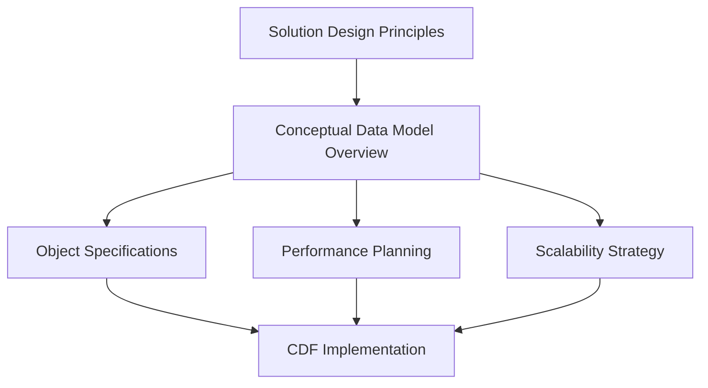

# Conceptual Data Model Overview Guide

## Overview

The Conceptual Data Model Overview document defines the **high-level structure**
of your data model. It maps business concepts to CDF objects and establishes the
essential relationships that form the foundation of your data architecture.

## Purpose

This document serves as the **bridge** between:

- Business requirements (from Solution Design Principles)
- Technical implementation (Object Specifications)
- Performance and scalability considerations

## When to Use This Template

### ✅ Use This Template When

- **Defining core business objects** for a new domain
- **Mapping business concepts** to CDF data types
- **Establishing relationships** between major entities
- **Planning data model performance** and scalability
- **Onboarding new team members** to the data architecture

### ❌ Don't Use This Template For

- Detailed property definitions (use Object Specification template)
- Technical implementation details
- Security configuration (use Solution Design Principles template)
- Individual object relationships (use Object Specification template)

## How to Complete the Template

### Step 1: Core Business Objects (Section 1)

1. **Identify Primary Entities**: List the main real-world concepts your
   business operates with
1. **Classify Object Types**: Categorize each object as:
   - **Physical Asset**: Equipment, facilities, locations
   - **Event**: Work orders, maintenance activities, incidents
   - **Document**: Reports, manuals, certificates
   - **Process**: Time series data, measurements, calculations

### Step 2: Relationships (Section 2)

1. **Map Connections**: Define how objects relate to each other
1. **Use Clear Descriptions**: Explain the business meaning of each relationship
1. **Consider Cardinality**: Think about one-to-many, many-to-many relationships

### Step 3: Performance Considerations (Section 3)

1. **Batching Strategy**: Plan for efficient data ingestion
1. **Indexing Strategy**: Identify frequently queried properties
1. **Data Partitioning**: Consider time-based or categorical splits
1. **Query Patterns**: Design for common access patterns

## Integration with Other Templates

This template **connects** the foundation to implementation:

- **Solution Design Principles** provides the business context and naming
  conventions
- **Object Specifications** detail each object identified here
- **Performance considerations** guide implementation decisions

## Best Practices

### ✅ Do This

- **Start with business concepts** - not technical implementation
- **Keep it high-level** - avoid detailed property definitions
- **Consider performance early** - plan for scale from the beginning
- **Use clear, business-friendly language** - avoid technical jargon
- **Reference industry examples** - leverage proven patterns

### ❌ Avoid This

- **Over-engineering** - don't add complexity you don't need
- **Technical details** - save implementation specifics for Object
  Specifications
- **Circular relationships** - keep the graph structure simple
- **Too many objects** - focus on the core 5-10 most important entities

## Common Patterns by Industry

### Oil & Gas

- **Assets**: Wells, Pipelines, Facilities
- **Events**: Work Orders, Maintenance Activities
- **Process**: Production Data, Pressure Measurements

### Manufacturing

- **Assets**: Plants, Machines, Equipment
- **Events**: Job Orders, Downtime Events
- **Process**: Sensor Data, Quality Measurements

### Utilities

- **Assets**: Substations, Feeders, Transformers
- **Events**: Outages, Maintenance Activities
- **Process**: Load Measurements, Power Flow Data

## Performance & Scalability Guidelines

### Data Volume Considerations

- **Small** (< 1M records): Simple relationships, minimal optimization needed
- **Medium** (1M - 100M records): Consider indexing and batching
- **Large** (> 100M records): Partitioning and advanced optimization required

### Query Pattern Optimization

- **Point queries**: Index on unique identifiers
- **Range queries**: Index on timestamp or numeric ranges
- **Graph traversal**: Limit depth to < 4 levels for performance

## Validation Checklist

Before proceeding to Object Specifications, ensure:

- [ ] All core business objects are identified and classified
- [ ] Relationships are clearly defined with business descriptions
- [ ] Performance considerations are documented
- [ ] Object types align with CDF capabilities
- [ ] No circular dependencies in relationships
- [ ] Object count is manageable (5-15 core objects)

## Next Steps

After completing this template:

1. **Create Object Specifications** - Detail each business object's properties
1. **Validate Relationships** - Ensure all referenced objects will be defined
1. **Plan Implementation** - Consider the performance implications
1. **Review with Stakeholders** - Confirm business alignment

## Template Location

📄 **Complete Template**:
[`templates/01_Conceptual_Data_Model_Overview.md`](templates/01_Conceptual_Data_Model_Overview.md)

______________________________________________________________________

> **Pro Tip**: This document should be reviewed by both business domain experts
> and data architects to ensure it accurately represents the business domain
> while being technically feasible.

______________________________________________________________________

← [Back to Framework Overview](index.md)
