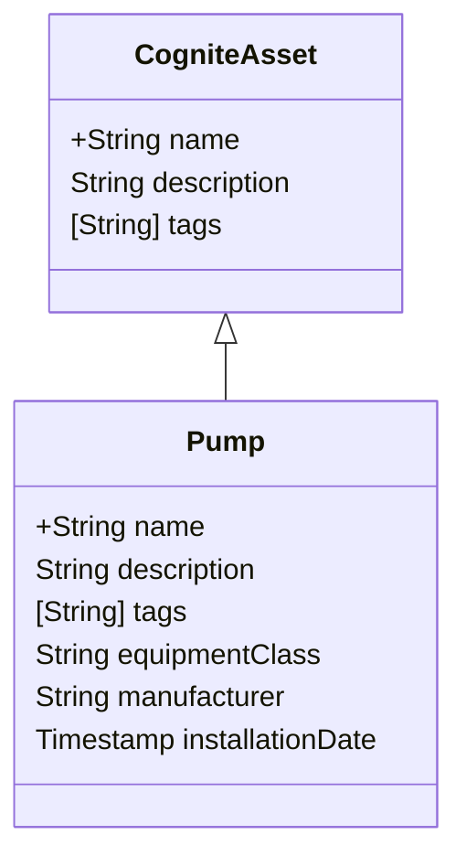

# Cognite GraphQL Integration Guide

> **Status**: Draft – Enterprise-grade guidance for embedding GraphQL in the CDF
> IaC framework. Lines kept ≤ 80 characters to satisfy markdown-lint.

______________________________________________________________________

## 1. Why GraphQL?

GraphQL Data Modelling Language (DML) lets you:

- Define view inheritance in a single source of truth.
- Version schemas without breaking existing clients.
- Express complex joins that map naturally to industrial hierarchies.

The CDF Framework treats a GraphQL schema as the *contract* between YAML
resources and consuming applications. Every container **must** have an
associated view in the schema; every view **should** inherit from a Cognite Core
concept (e.g. `CogniteAsset`).

______________________________________________________________________

## 2. Core Concepts

| Concept | Description | | ------------------- |
------------------------------------------------------- | | Interface | Abstract
type that other types implement | | Type | Concrete object exposed through a
view | | Field Directive | Adds metadata (`@unit`, `@indexed`) to a property | |
Version Tag | `@view(version:"v1")` forces deterministic evolution |

______________________________________________________________________

## 3. Schema Inheritance Pattern

```graphql
# Inherit from CogniteAsset in Core Data Model
interface CogniteAsset {
  name: String!
  description: String
  tags: [String]
}

type Pump implements CogniteAsset @view(space:"pump_space", version:"v1") {
  name: String!
  description: String
  tags: [String]
  equipmentClass: String @indexed
  manufacturer: String
  installationDate: Timestamp
}
```

### Mermaid View Map



______________________________________________________________________

## 4. Version Management Strategy

1. Start every new type at **v1**.
1. Non-breaking changes (optional field) → increment *minor* `v1.1`.
1. Breaking changes (rename, required field) → increment *major* `v2`.
1. Deprecate, do not delete. Use `@deprecated(reason:"…")`.

______________________________________________________________________

## 5. Query Optimisation Examples

Good – filter on indexed property:

```graphql
query PumpByClass {
  pump(filter:{equipmentClass:{eq:"ISO_14224_2110"}}) {
    name
    manufacturer
  }
}
```

Bad – no filtering, large result set:

```graphql
query AllPumps {
  pump {
    name
    manufacturer
  }
}
```

______________________________________________________________________

## 6. Python SDK: Auto-generating Views

```python
from cognite.client import CogniteClient
from cognite.client.data_classes import data_modeling as dm

client = CogniteClient()

pump_view = dm.View(
    space="pump_space",
    external_id="Pump",
    version="v1",
    implements=["cdf_cdm:CogniteAsset"],
    properties={
        "equipmentClass": dm.Text(indexed=True),
        "manufacturer": dm.Text(indexed=True),
        "installationDate": dm.Timestamp(),
    },
)

client.data_modeling.views.apply(pump_view)
```

______________________________________________________________________

## 7. Best Practices & Pitfalls

- Prefer **interfaces** over deep type hierarchies – easier to version.
- Always tag views with `space` and `version` for deterministic IaC diffs.
- Limit result sets with `filter` and `limit` clauses to keep query latency < 1
  s.
- Validate the schema in CI using `cdfdm compile` before merge.

______________________________________________________________________

*End of document*
