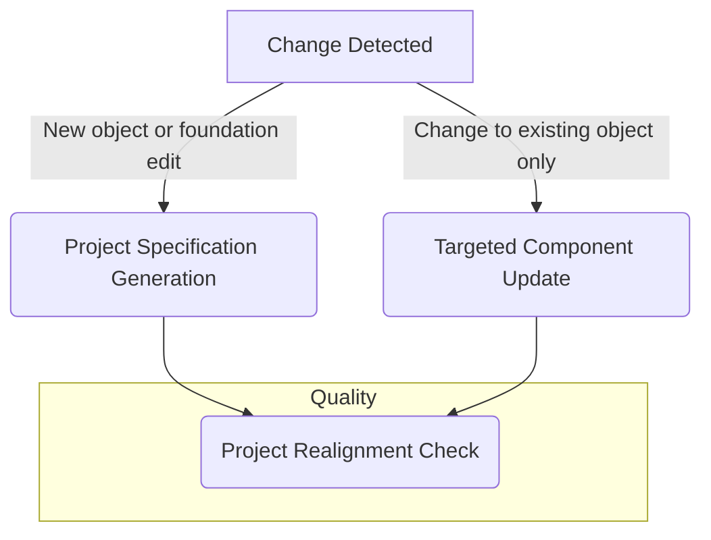
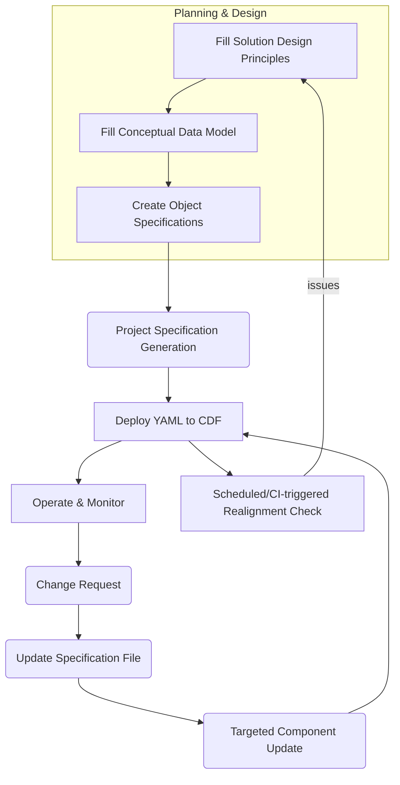

# CDF IaC Framework Overview

> A document-driven, AI-assisted methodology for designing, generating and
> operating Cognite Data Fusion projects as Infrastructure-as-Code.

______________________________________________________________________

## 1. Why Use a Document-Driven Approach?

1. **Start with business value** – every technical artefact traces back to a
   clearly stated goal.
1. **Shared vocabulary** – Markdown templates are readable by both domain
   experts and engineers.
1. **Single source of truth** – the filled templates become living contracts
   that AI workflows compile into executable IaC.
1. **Progressive elaboration** – begin with high-level principles, add detail
   only where needed.

______________________________________________________________________

## 2. Repository Layout

```
docs/cdf_framework/
├── templates/                # Blank templates & AI instructions
│   ├── 00_Solution_Design_Principles.md
│   ├── 01_Conceptual_Data_Model_Overview.md
│   ├── XX_Object_Specification_Template.md
│   └── instructions/
│       ├── 01_INITIAL_PROJECT_GENERATION.md
│       ├── 02_TARGETED_COMPONENT_UPDATE.md
│       └── 03_PROJECT_REALIGNMENT_CHECK.md
├── *_guide.md               # How-to guides for each artefact
├── best_practices/          # Opinionated rules & patterns
└── examples/                # End-to-end reference implementations
```

______________________________________________________________________

## 3. The Three Core Workflows

| # | Workflow | Purpose | Triggers | |---|-----------|---------|----------| | 1
| **Project Specification Generation** <br> (file:
`01_INITIAL_PROJECT_GENERATION.md`) | Convert filled templates into JSON
specifications and a complete CDF Toolkit YAML bundle. | • New project <br> •
Adding / renaming / deleting a **business object** <br> • Changing datasets,
environments, naming conventions or security roles | | 2 | **Targeted Component
Update** <br> (file: `02_TARGETED_COMPONENT_UPDATE.md`) | Incrementally change
**one existing object** and regenerate only its YAML artefacts with impact
analysis & rollback plan. | • New property / relationship <br> • Transformation
tweak <br> • Any change confined to a single object | | 3 | **Project
Realignment Check** <br> (file: `03_PROJECT_REALIGNMENT_CHECK.md`) | Read-only
audit that identifies gaps, inconsistencies and quality metrics across **all**
specifications. Designed for CI/CD gates. | • Pre-deployment quality gate <br> •
Regular health check <br> • On-boarding / due-diligence audit |

### 3.1 Workflow Decision Tree



______________________________________________________________________

## 4. Template → Workflow Map

| Template (Human-edited) | Consumed by Workflow | Output |
|-------------------------|----------------------|--------| |
`00_Solution_Design_Principles.md` | Generation · Realignment |
`design_principles.json` | | `01_Conceptual_Data_Model_Overview.md` | Generation
· Realignment | `conceptual_model.json` | | `*_Specification.md` (clone of
`XX_…`) | Generation · Component Update · Realignment | `*_spec.json` |

______________________________________________________________________

## 5. End-to-End Lifecycle



______________________________________________________________________

## 6. Quick-Start Recipes

### 6.1 New Project

1. Duplicate the three templates in `templates/` into your project folder.
1. Fill every `<REPLACE_ME>` placeholder.
1. Run **Project Specification Generation**.
1. Review the generated `config/` directory and run
   `cognite toolkit apply --dry-run`.

### 6.2 Add a Property to an Object

1. Edit `docs/<ObjectName>_Specification.md` → add the property block.
1. Run **Targeted Component Update**.
1. Inspect the diff report, obtain approval, deploy, monitor.

### 6.3 Quarterly Quality Audit

1. Trigger **Project Realignment Check** in CI or locally.
1. Review `PROJECT_VALIDATION_REPORT.md`. Fix critical issues via Workflow 1 or
   2\.

______________________________________________________________________

## 7. Navigation Guide

| Learning Path | Read This First | Then | Finally |
|---------------|-----------------|------|---------| | Understand the philosophy
| Framework Overview (this doc) | Solution Design Principles Guide | Conceptual
\+ Object Guides | | Build a new project | Solution Design Principles Guide |
Conceptual Model Guide | Project Specification Generation Guide | | Evolve an
existing project | Object Specification Guide | Targeted Component Update Guide
| Project Realignment Guide | | Deep-dive best practices |
best_practices/index.md | relevant sub-pages | examples/ |

______________________________________________________________________

## 8. Further Reading & Support

- **Best Practices** – opinionated rules for scaling, security, SDK usage.
- **Examples** – real-world reference implementations.
- **Troubleshooting Guide** – common errors and resolutions.
- **Glossary** – shared terminology across all docs.

For questions or contributions, open an issue or contact the Data Engineering
Guild.
