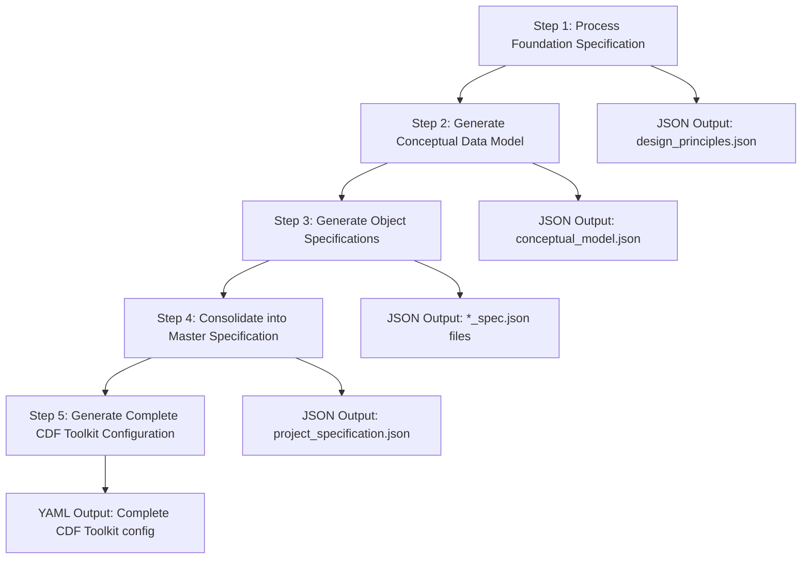
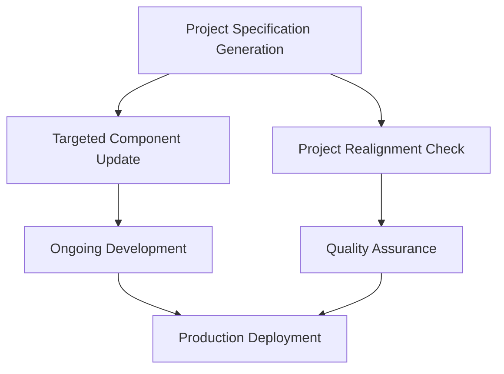

# Project Specification Generation Guide

## Overview

The Project Specification Generation workflow is a **comprehensive AI-assisted
process** that converts up-to-date business requirements into a complete,
deployable CDF Toolkit configuration. It can be run on Day 1 *or* the 50th
iteration – every time the project foundation or object roster changes. This
workflow transforms business requirements into deployable CDF Toolkit
configuration files through a structured 5-step process.

## Purpose

This workflow serves as the **complete project scaffolding process** for:

- Converting business specifications into technical implementation
- Generating all necessary CDF Toolkit YAML files
- Creating a deployable project structure
- Establishing validation and quality checks
- Setting up the foundation for ongoing development

## When to Use This Workflow

### ✅ Use This Workflow When

- **Starting a new CDF project** from business requirements
- **Adding, renaming, or removing a business object**
- **Changing foundation elements** (datasets, environments, naming conventions,
  security roles)
- **Re-generating the full specification layer** after large scope changes
- **Converting existing markdown specifications** into a fresh YAML bundle

### ❌ Don't Use This Workflow For

- **Property-level tweaks** to existing objects (use Targeted Component Update)
- **Read-only audits** of an existing project (use Project Realignment Check)
- Routine maintenance or CI scripts
- Single-object hot-fixes

## Workflow Overview

The Project Specification Generation workflow follows a **5-step process**:



## Step-by-Step Process

### Step 1: Process Foundation Specification

**Input**: Populated `00_Solution_Design_Principles.md` **Output**:
`design_principles.json` and gap analysis

**Key Activities**:

- Validate all placeholders are filled
- Generate structured JSON from markdown
- Identify missing information and inconsistencies
- Create assumptions and gaps documentation

### Step 2: Generate Conceptual Data Model

**Input**: Populated `01_Conceptual_Data_Model_Overview.md` **Output**:
`conceptual_model.json`

**Key Activities**:

- Extract core business objects and relationships
- Validate object types and classifications
- Cross-reference with foundation specification
- Document performance considerations

### Step 3: Generate Object Specifications

**Input**: All `*_Specification.md` files **Output**: Individual `*_spec.json`
files for each object

**Key Activities**:

- Process detailed property definitions
- Validate data types and relationships
- Map source system fields to CDF properties
- Define time series and validation rules

### Step 4: Consolidate into Master Specification

**Input**: All JSON files from previous steps **Output**:
`project_specification.json`

**Key Activities**:

- Combine all specifications into single master file
- Validate cross-references and consistency
- Generate validation summary
- Create final gap analysis

### Step 5: Generate Complete CDF Toolkit Configuration

**Input**: `project_specification.json` **Output**: Complete directory structure
with all YAML files

**Key Activities**:

- Generate containers, views, and transformations
- Create environment-specific configurations
- Set up data sets and security roles
- Validate against CDF Toolkit schemas

## Expected Outputs

### Directory Structure

```
config/
├── config.dev.yaml
├── config.prod.yaml
└── modules/
    └── {module_name}/
        ├── {module_name}.datamodel.yaml
        ├── data_models/
        │   ├── containers/
        │   └── views/
        ├── transformations/
        └── data_sets/
```

### Key Files Generated

- **Environment Configs**: `config.dev.yaml`, `config.prod.yaml`
- **Data Models**: Containers and views for each business object
- **Transformations**: SQL transformations for data ingestion
- **Data Sets**: Configuration for data organization
- **Security**: Group definitions and access controls

## Integration with Other Workflows

This workflow **feeds into** other workflows:



- **Targeted Component Update**: Uses the generated structure for incremental
  changes
- **Project Realignment Check**: Validates the generated configuration against
  requirements

## Best Practices

### ✅ Do This

- **Complete all templates first** - ensure all placeholders are filled before
  starting
- **Validate at each step** - run validation checks between steps
- **Review generated YAML** - inspect the output before deployment
- **Test with dry-run** - use `cognite toolkit apply --dry-run` before live
  deployment
- **Document assumptions** - keep track of decisions made during generation

### ❌ Avoid This

- **Skipping validation steps** - can lead to deployment failures
- **Running without complete specs** - will result in gaps and errors
- **Deploying without review** - always inspect generated YAML first
- **Ignoring gap analysis** - address identified issues before proceeding

## Common Errors & Troubleshooting

| Error Type | Symptom | Resolution | |------------|---------|------------| |
`MissingPlaceholderError` | Unfilled `<REPLACE_ME>` tags | Complete all template
placeholders | | `RelationshipMismatchError` | Inconsistent object references |
Ensure exact name matching between specs | | `TypeValidationError` | Invalid
data types | Use only allowed CDF data types | | `SchemaViolation` | Invalid
YAML structure | Regenerate with corrected specifications |

## Validation Checklist

Before proceeding to deployment, ensure:

- [ ] All 5 steps completed successfully
- [ ] No critical errors in validation reports
- [ ] Generated YAML passes schema validation
- [ ] Environment configurations are correct
- [ ] Security roles and permissions are properly defined
- [ ] Data source mappings are accurate
- [ ] Transformation SQL is valid

## Next Steps

After completing this workflow:

1. **Review Generated Configuration** - Inspect all YAML files for accuracy
1. **Run Dry-Run Deployment** - Test with `cognite toolkit apply --dry-run`
1. **Address Any Issues** - Fix validation errors or gaps
1. **Deploy to Development** - Apply configuration to dev environment
1. **Validate Functionality** - Test data ingestion and queries
1. **Promote to Production** - Deploy to production environment

## Template Location

📄 **Complete AI Instruction**:
[`templates/instructions/01_INITIAL_PROJECT_GENERATION.md`](templates/instructions/01_INITIAL_PROJECT_GENERATION.md)

______________________________________________________________________

> **Pro Tip**: This workflow should be run by experienced CDF practitioners who
> understand both the business domain and technical implementation. Consider
> running it in a development environment first to validate the generated
> configuration.
