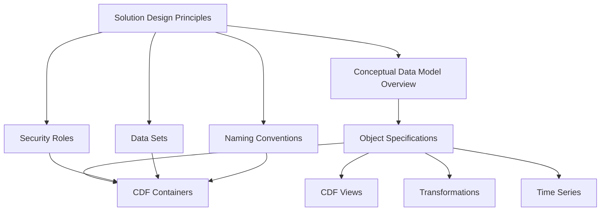

# Object Specification Guide

## Overview

The Object Specification template defines the **detailed structure** of
individual business objects. It transforms high-level concepts into concrete CDF
containers, views, and transformations with specific properties, relationships,
and validation rules.

## Purpose

This document serves as the **implementation blueprint** for:

- Detailed property definitions with data types and constraints
- Source system mappings and transformation rules
- Relationship definitions and target object references
- Time series attachments and external ID patterns
- Data quality validation rules and business logic

## When to Use This Template

### ✅ Use This Template When

- **Defining detailed properties** for a business object
- **Mapping source system fields** to CDF properties
- **Establishing relationships** between specific objects
- **Defining time series** that belong to an object
- **Setting up data quality rules** and validation logic
- **Creating CDF containers and views** for implementation

### ❌ Don't Use This Template For

- High-level business concepts (use Conceptual Data Model Overview)
- Project-wide configuration (use Solution Design Principles)
- Cross-object architecture decisions
- Security and access management

## How to Complete the Template

### Step 1: Object Foundation (Sections 1-2)

1. **Object Description**: Write a clear summary of what this object represents
1. **External ID**: Choose a unique, snake_case identifier
1. **Data Source**: Identify the source system and RAW table
1. **Data Set**: Reference the appropriate dataset from Solution Design
   Principles

### Step 2: Properties (Section 3)

1. **Property Names**: Use camelCase for CDF property names
1. **Data Types**: Choose appropriate CDF data types (text, int64, float64,
   etc.)
1. **Nullable Fields**: Mark optional properties as nullable
1. **Source Mapping**: Map to exact column names in RAW tables
1. **Transformations**: Add SQL expressions for data cleaning/transformation

### Step 3: Relationships (Section 4)

1. **Target Objects**: Reference other objects by their external IDs
1. **Source Fields**: Identify the foreign key columns
1. **Relationship Types**: Use 'direct' for simple references
1. **Descriptions**: Explain the business meaning of each relationship

### Step 4: Time Series (Section 5)

1. **Time Series Names**: Use descriptive names for measurements
1. **External ID Patterns**: Use `{{field_name}}` to reference object properties
1. **Descriptions**: Explain what each time series measures

### Step 5: Data Quality (Section 6)

1. **Validation Rules**: Define automatic checks for data integrity
1. **Severity Levels**: Classify issues as Critical, High, Medium, or Warning
1. **Implementation**: Specify how to implement each validation rule

## Integration with Other Templates

This template **implements** the concepts defined in other templates:



- **Solution Design Principles** provides datasets, security roles, and naming
  conventions
- **Conceptual Data Model Overview** identifies which objects need
  specifications
- **CDF Implementation** uses these specs to generate containers, views, and
  transformations

## Best Practices

### ✅ Do This

- **Use camelCase** for property names and snake_case for external IDs
- **Prefer int64** over int32 for IDs to future-proof key space
- **Store reference enums** as text but document allowed values
- **Add units** in property descriptions for all numeric measurements
- **Keep relationships single-directional** to reduce graph complexity
- **Use descriptive names** that business users will understand

### ❌ Avoid This

- **Over-normalization** - don't split objects unnecessarily
- **Circular relationships** - can cause infinite loops in queries
- **Too many properties** - focus on the most important 10-20 properties
- **Ambiguous data types** - be specific about precision and scale
- **Missing transformations** - clean data during ingestion, not in queries

## Data Type Guidelines

### Text Properties

- **Short text** (< 255 chars): Use `text` type
- **Long text** (> 255 chars): Use `text` type (CDF handles large text)
- **Enums**: Use `text` with documented allowed values
- **Identifiers**: Use `text` for external system IDs

### Numeric Properties

- **Integers**: Use `int64` for IDs, `int32` for small counts
- **Decimals**: Use `float64` for measurements, `float32` for simple ratios
- **Currency**: Use `float64` with clear unit documentation

### Temporal Properties

- **Timestamps**: Use `timestamp` type with ISO 8601 format
- **Dates only**: Use `timestamp` type (CDF doesn't have separate date type)
- **Time zones**: Always specify UTC in documentation

## Relationship Patterns

### One-to-Many

```yaml
# Parent object (Asset)
relationships:
  - name: children
    targetType: asset_view
    sourceField: PARENT_ASSET_ID

# Child object (Asset)
relationships:
  - name: parent
    targetType: asset_view
    sourceField: PARENT_ASSET_ID
```

### Many-to-Many

```yaml
# Use junction objects for complex relationships
# WorkOrder -> WorkOrderEquipment <- Equipment
```

## Time Series Patterns

### Standard Naming Convention

```
{source_system}:{object_type}:{object_id}:{measurement_type}
```

### Examples

- `scada:well:WELL_001:pressure`
- `pi:equipment:PUMP_123:temperature`
- `historian:asset:COMPRESSOR_456:flow_rate`

## Validation Rule Examples

### Data Quality Rules

| Rule Type | Example | Implementation |
|-----------|---------|----------------| | Uniqueness | `externalId` must be
unique | SQL `COUNT(*) vs COUNT(DISTINCT)` | | Range Check | Timestamps must be
in past | Transformation `WHERE timestamp <= NOW()` | | Enum Validation | Status
must be valid | dbt `accepted_values` test | | Completeness | Required fields \<
1% null | Python assertion on null ratio |

## Validation Checklist

Before proceeding to implementation, ensure:

- [ ] All properties have appropriate data types and nullability
- [ ] Source field mappings match actual RAW table columns
- [ ] Relationship targets reference valid object external IDs
- [ ] Time series external ID patterns use valid property references
- [ ] Validation rules are implementable and measurable
- [ ] External ID follows naming conventions from Solution Design Principles
- [ ] All required properties from Solution Design Principles are included

## Next Steps

After completing this template:

1. **Generate CDF Artifacts** - Use AI workflow to create containers and views
1. **Implement Transformations** - Create SQL transformations for data ingestion
1. **Set Up Validation** - Implement data quality checks
1. **Test with Sample Data** - Validate the specification with real data

## Template Location

📄 **Complete Template**:
[`templates/XX_Object_Specification_Template.md`](templates/XX_Object_Specification_Template.md)

______________________________________________________________________

> **Pro Tip**: Create one specification file per business object, and use the
> reference example in the template as a starting point for your specific
> domain.

______________________________________________________________________

← [Back to Framework Overview](index.md)
