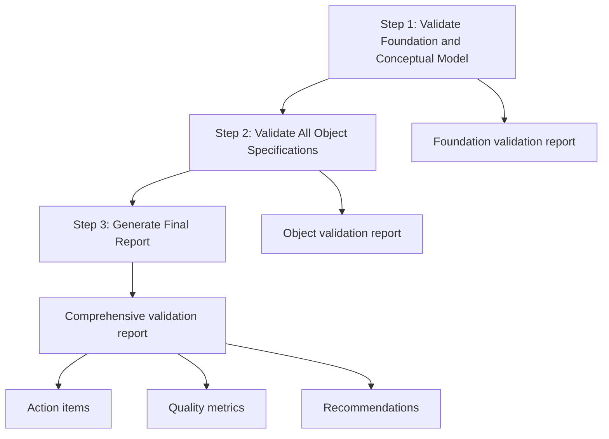

# Project Realignment Guide

## Overview

The Project Realignment Check workflow is a **comprehensive validation audit**
process for existing CDF projects. This workflow performs a read-only analysis
to identify gaps, inconsistencies, and quality issues across the entire
specification layer.

## Purpose

This workflow serves as the **quality assurance process** for:

- Validating project specification completeness and consistency
- Identifying gaps and missing information
- Ensuring cross-reference integrity across all documents
- Providing actionable quality metrics and recommendations
- Supporting continuous improvement of CDF projects

## When to Use This Workflow

### ✅ Use This Workflow When

- **Validating existing projects** before major changes
- **Onboarding new team members** to understand project quality
- **Preparing for audits** or compliance reviews
- **Identifying technical debt** in specifications
- **Planning project improvements** or refactoring
- **Ensuring project readiness** for production deployment

### ❌ Don't Use This Workflow For

- Creating new projects (use Project Specification Generation)
- Making incremental changes (use Targeted Component Update)
- Routine maintenance tasks
- Real-time monitoring of deployed systems

## Workflow Overview

The Project Realignment Check follows a **3-step validation process**:



## Step-by-Step Process

### Step 1: Validate Foundation and Conceptual Model

**Input**: `00_Solution_Design_Principles.md` and
`01_Conceptual_Data_Model_Overview.md` **Output**: Foundation validation report

**Key Activities**:

- Check for unfilled `<REPLACE_ME>` placeholders
- Validate cross-references between foundation and conceptual model
- Ensure all referenced external IDs are properly defined
- Verify naming conventions and standards consistency
- Document any inconsistencies or gaps found

### Step 2: Validate All Object Specifications

**Input**: All `*_Specification.md` files and master specification **Output**:
Comprehensive object validation report

**Key Activities**:

- Validate each object specification against the conceptual model
- Check for missing properties, relationships, or time series
- Verify data source consistency and RAW table references
- Validate relationship targets and cross-references
- Assess data quality rules and validation logic

### Step 3: Generate Final Report

**Input**: All validation results and gap analysis **Output**: Actionable
validation report with recommendations

**Key Activities**:

- Consolidate all validation findings
- Generate quality metrics and scores
- Create prioritized action items
- Provide specific recommendations for improvement
- Set up continuous integration hooks for ongoing validation

## Validation Areas

### Foundation Validation

- **Project Overview**: Business goals, stakeholders, and scope
- **Environment Configuration**: Source IDs, datasets, and security roles
- **Naming Conventions**: Consistency across all specifications
- **Cross-References**: Internal consistency between documents

### Conceptual Model Validation

- **Business Objects**: Completeness and proper classification
- **Relationships**: Logical connections and cardinality
- **Performance Considerations**: Scalability and optimization plans
- **Industry Alignment**: Best practices and patterns

### Object Specification Validation

- **Properties**: Data types, nullability, and source mappings
- **Relationships**: Target references and foreign key mappings
- **Time Series**: External ID patterns and descriptions
- **Validation Rules**: Data quality checks and business logic

## Quality Metrics & Thresholds

### Validation Metrics

| Metric | Threshold | CI Fail Condition |
|--------|-----------|-------------------| | Critical Issues | 0 |
`critical > 0` | | Total Placeholders | 0 | `placeholders > 0` | | Invalid
Relationships | 0 | any | | Undefined Datasets | 0 | any | | Naming Convention
Violations | < 5 | `violations >= 5` |

### Quality Scoring

- **Excellent** (90-100%): All validations pass, minimal warnings
- **Good** (80-89%): Minor issues, easily addressable
- **Fair** (70-79%): Some issues requiring attention
- **Poor** (< 70%): Significant issues requiring immediate action

## Expected Outputs

### Validation Report Structure

```markdown
# Project Validation Report

**Generated:** 2024-01-15T10:30:00Z
**Project:** [Project Name]
**Validation Status:** ✅ PASS / ❌ FAIL

## Executive Summary
- Total Issues: X
- Critical Issues: Y
- Warnings: Z
- Recommendation: [Action required]

## Foundation Specification Validation
### ✅ Valid Elements
- [List of valid elements]

### ❌ Issues Found
- [List of issues with severity]

## Object Specification Validation
### [Object Name]
#### ✅ Valid Elements
- [List of valid elements]

#### ❌ Issues Found
- [List of issues with severity]

## Cross-Reference Validation
### ❌ Inconsistencies Found
- [List of inconsistencies]

## Action Items
### 🔴 Critical (Must Fix)
1. [Action item 1]
2. [Action item 2]

### 🟡 High Priority
1. [Action item 3]
2. [Action item 4]
```

## Integration with CI/CD

### Automated Validation Hook

```yaml
name: Project Realignment Validation

on:
  pull_request:
    paths:
      - "docs/**.md"
      - "docs/specifications/**.json"

jobs:
  validate:
    runs-on: ubuntu-latest
    steps:
      - uses: actions/checkout@v4
      - name: Run realignment check
        run: |
          python tools/ci_realignment.py \
            --principles docs/00_Solution_Design_Principles.md \
            --conceptual docs/01_Conceptual_Data_Model_Overview.md \
            --spec-dir docs/specifications/ \
            --report docs/PROJECT_VALIDATION_REPORT.md
```

## Best Practices

### ✅ Do This

- **Run validation regularly** - integrate into CI/CD pipeline
- **Address critical issues first** - prioritize by severity
- **Document decisions** - keep track of why certain choices were made
- **Review with stakeholders** - ensure business alignment
- **Set up monitoring** - track quality metrics over time

### ❌ Avoid This

- **Ignoring warnings** - they can become critical issues later
- **Running without context** - understand the business domain first
- **Skipping stakeholder review** - ensure business requirements are met
- **Treating validation as optional** - make it part of your development process

## Common Issues & Resolutions

| Issue Type | Common Cause | Resolution |
|------------|--------------|------------| | Missing placeholders | Incomplete
template filling | Complete all `<REPLACE_ME>` tags | | Cross-reference errors |
Inconsistent naming | Standardize external IDs and names | | Undefined datasets
| Missing foundation setup | Add dataset definitions to principles | | Invalid
relationships | Missing target objects | Ensure all referenced objects exist | |
Naming violations | Inconsistent conventions | Apply consistent naming standards
|

## Validation Checklist

Before considering the project ready for production:

- [ ] All critical issues resolved
- [ ] All placeholders filled
- [ ] Cross-references validated
- [ ] Naming conventions consistent
- [ ] Data sources properly defined
- [ ] Relationships logically sound
- [ ] Quality metrics meet thresholds
- [ ] Stakeholder approval obtained

## Next Steps

After completing this workflow:

1. **Address Critical Issues** - Fix all critical validation failures
1. **Review Recommendations** - Implement suggested improvements
1. **Update Documentation** - Reflect any changes made
1. **Set Up Monitoring** - Implement ongoing validation checks
1. **Plan Improvements** - Schedule regular quality reviews
1. **Share Results** - Communicate findings with stakeholders

## Template Location

📄 **Complete AI Instruction**:
[`templates/instructions/03_PROJECT_REALIGNMENT_CHECK.md`](templates/instructions/03_PROJECT_REALIGNMENT_CHECK.md)

______________________________________________________________________

> **Pro Tip**: This workflow is most effective when run regularly as part of
> your development process. Consider integrating it into your CI/CD pipeline to
> catch issues early and maintain high project quality standards.
