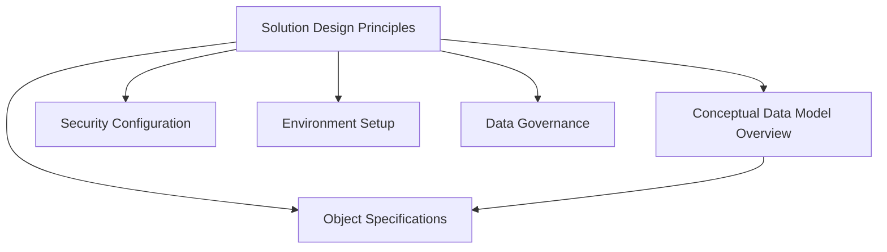

# Solution Design Principles Guide

## Overview

The Solution Design Principles document is the **foundation** of any CDF
project. It captures the highest-level decisions that drive all downstream
technical choices and ensures alignment between business objectives and
technical implementation.

## Purpose

This document serves as the **single source of truth** for:

- Project scope and business goals
- Security and access management strategy
- Data governance and naming conventions
- Environment configuration and deployment strategy

## When to Use This Template

### ✅ Use This Template When

- **Starting a new CDF project** from scratch
- **Onboarding a new team** to an existing project
- **Major project restructuring** or scope changes
- **Security model updates** requiring new roles or permissions
- **Multi-environment deployments** (dev, test, prod)

### ❌ Don't Use This Template For

- Minor feature additions to existing objects
- Routine data model updates
- Individual object specifications (use the Object Specification template
  instead)

## How to Complete the Template

### Step 1: Business Context (Sections 1-2)

1. **Project Overview**: Define the business goal in **one measurable sentence**
1. **Project Glossary**: Add every acronym, term, or abbreviation used in the
   project
1. **Key Stakeholders**: Identify who will use the solution and their roles

### Step 2: Technical Foundation (Section 3)

1. **Environments**: Define dev/test/prod with proper source IDs from your
   Identity Provider
1. **CDF Data Space**: Choose a descriptive external ID for your data model
1. **Data Sets**: Group data by source system and purpose
1. **RAW Databases**: Map source systems to CDF RAW tables
1. **Security Roles**: Define who can read/write what data

### Step 3: Standards & Governance (Section 4)

1. **Naming Conventions**: Establish consistent patterns for external IDs
1. **Timestamp Standards**: Choose ISO 8601 with UTC timezone
1. **Required Properties**: Define mandatory fields for all objects

## Integration with Other Templates

This template **feeds into** the other templates:

- **Conceptual Data Model Overview** uses the data sets and naming conventions
  defined here
- **Object Specifications** reference the source systems and security roles
  defined here
- **CDF Toolkit** uses the environment configurations to generate deployment
  files

## Best Practices

### ✅ Do This

- **Start with business value** - every technical decision should trace back to
  a business goal
- **Use consistent naming** - establish patterns early and stick to them
- **Document source IDs** - collect Azure AD group object IDs before starting
- **Plan for scale** - consider how the solution will grow over time

### ❌ Avoid This

- **Vague business goals** - "Improve efficiency" is not measurable
- **Missing source IDs** - will cause CI/CD pipeline failures
- **Over-granular RAW tables** - group low-volume tables where possible
- **Ambiguous terms** - define every acronym in the glossary

## Common Pitfalls & Solutions

| Pitfall | Symptom | Solution | |---------|---------|----------| | Vague
business goal | Misaligned data model & KPIs | Summarize business value in **one
measurable sentence** | | Missing source IDs | CI/CD pipeline fails during
security-group creation | Collect Azure AD group object IDs before running
generation | | Ambiguous glossary terms | Inconsistent naming across modules |
Add glossary entries for **every new acronym** introduced | | Over-granular RAW
tables | Excessive ingestion cost | Group low-volume tables into a single RAW
table where possible |

## Validation Checklist

Before proceeding to the next template, ensure:

- [ ] All `<REPLACE_ME>` placeholders are filled
- [ ] At least **one environment** (`dev`) configured with valid IDs
- [ ] Every dataset has a clear **ownership description**
- [ ] Security roles reference **existing** variables from Environments section
- [ ] Global naming convention example matches sample IDs in the template
- [ ] Document passes linting (`markdownlint .`)

## Next Steps

After completing this template:

1. **Move to Conceptual Data Model Overview** - Define your core business
   objects
1. **Create Object Specifications** - Detail each business object's properties
   and relationships
1. **Run Project Specification Generation** - Use the AI workflow to scaffold
   your CDF project

## Template Location

📄 **Complete Template**:
[`templates/00_Solution_Design_Principles.md`](templates/00_Solution_Design_Principles.md)

______________________________________________________________________

> **Pro Tip**: This document should be reviewed and approved by both business
> stakeholders and technical architects before proceeding to the next phase.

______________________________________________________________________

← [Back to Framework Overview](index.md)
