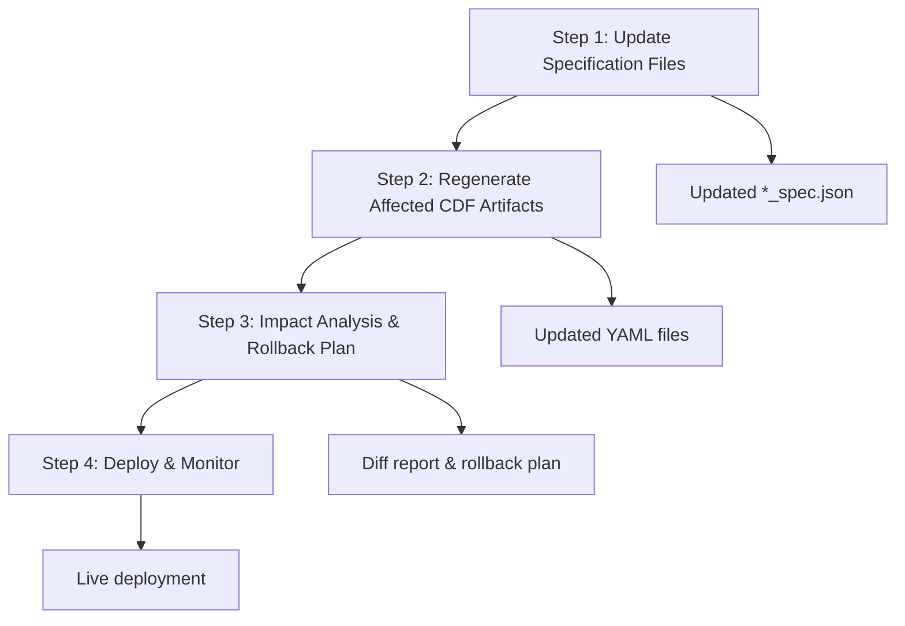
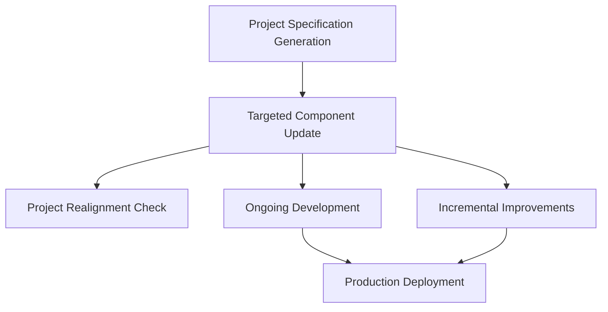

# Targeted Component Update Guide

## Overview

The Targeted Component Update workflow is an **incremental modification
process** for updating individual business objects within an existing CDF
project. This workflow allows for precise, controlled changes to specific
components without affecting the entire project structure.

## Purpose

This workflow serves as the **change management process** for:

- Updating individual business object specifications
- Regenerating only affected CDF artifacts
- Performing impact analysis before deployment
- Managing incremental project evolution
- Maintaining project consistency during updates

## When to Use This Workflow

### ✅ Use This Workflow When

- **Adding new properties** to existing business objects
- **Modifying relationships** between objects
- **Updating data types** or validation rules
- **Adding new time series** to existing objects
- **Refining transformation logic** for data ingestion
- **Making incremental improvements** to the data model

### ❌ Don't Use This Workflow For

- Complete project restructuring (use Project Specification Generation)
- Cross-cutting changes affecting multiple objects
- Validation of existing projects (use Project Realignment Check)
- Major architectural changes

## Workflow Overview

The Targeted Component Update follows a **4-step process**:



## Step-by-Step Process

### Step 1: Update Specification Files

**Input**: Modified `[ObjectName]_Specification.md` file **Output**: Updated
`[ObjectName]_spec.json` and master specification

**Key Activities**:

- Read the updated markdown specification
- Regenerate the corresponding JSON specification
- Update the master `project_specification.json`
- Validate the changes against existing specifications
- Document any new gaps or assumptions

### Step 2: Regenerate Only Affected CDF Artifacts

**Input**: Updated `project_specification.json` and object external ID
**Output**: Updated YAML files for the specific object

**Key Activities**:

- Identify which YAML files need regeneration
- Generate updated containers, views, and transformations
- Update the main datamodel YAML file
- Validate the regenerated YAML files
- Generate a diff report showing changes

### Step 3: Impact Analysis & Rollback Plan

**Input**: Generated YAML files and diff report **Output**: Impact assessment
and rollback scripts

**Key Activities**:

- Generate comprehensive diff report
- Classify changes (BREAKING, NON_BREAKING, PERFORMANCE, SECURITY)
- Estimate potential downtime or performance impact
- Create rollback scripts and safety measures
- Obtain stakeholder approval for changes

### Step 4: Deploy & Monitor

**Input**: Validated YAML files and rollback plan **Output**: Live deployment
with monitoring

**Key Activities**:

- Run dry-run deployment to validate changes
- Execute live deployment with monitoring
- Run post-deployment smoke tests
- Monitor performance and error rates
- Execute rollback if issues arise

## Expected Changes

### Files Typically Modified

- **Container YAML**: `{object_externalId}.container.yaml`
- **View YAML**: `{object_externalId}.view.yaml`
- **Transformation YAML**:
  `{object_externalId}_transformation.transformation.yaml`
- **Datamodel YAML**: Main datamodel file to ensure view list is correct

### Example: Adding New Property to Well Object

```yaml
# Before Update
properties:
  wellId: { type: text, nullable: false }
  wellName: { type: text, nullable: false }

# After Update
properties:
  wellId: { type: text, nullable: false }
  wellName: { type: text, nullable: false }
  completionDate: { type: timestamp, nullable: true }  # New property
```

## Integration with Other Workflows

This workflow **builds upon** other workflows:



- **Project Specification Generation**: Provides the foundation structure to
  modify
- **Project Realignment Check**: Validates changes don't break overall project
  alignment

## Best Practices

### ✅ Do This

- **Make incremental changes** - update one object at a time
- **Validate before deployment** - run dry-run tests
- **Document changes** - keep track of what was modified and why
- **Test in development** - always test changes in dev environment first
- **Monitor after deployment** - watch for performance impacts

### ❌ Avoid This

- **Making multiple unrelated changes** - can complicate rollback
- **Skipping impact analysis** - may cause unexpected issues
- **Deploying without testing** - always validate changes first
- **Ignoring rollback procedures** - have a safety net ready

## Common Pitfalls & Solutions

| Pitfall | Symptom | Solution | |---------|---------|----------| | Forgetting
to update datamodel.yaml | Toolkit error "view not found" | Re-run datamodel
update step | | Adding non-nullable property without default | Transformation
fails on NULL | Provide COALESCE() or set nullable: true | | Breaking
relationship targets | View creation fails | Validate target external IDs exist
| | Overwriting unrelated YAML | Git diff shows large changes | Use --object
flag to limit scope |

## Impact Analysis Guidelines

### Change Classification

- **BREAKING**: Changes that will cause existing queries to fail
- **NON_BREAKING**: Additive changes that don't affect existing functionality
- **PERFORMANCE**: Changes that may impact query or ingestion performance
- **SECURITY**: Changes affecting access controls or data visibility

### Before/After Metrics

| Metric | Before Update | After Update | Threshold |
|--------|---------------|--------------|-----------| | Container properties | 6
| 8 | Monitor for performance impact | | Transformation runtime | 2m 15s | 2m
18s | < 10% increase | | View query latency (p95) | 750 ms | 780 ms | < 20%
increase |

## Validation Checklist

Before proceeding to deployment, ensure:

- [ ] Only the intended object was modified
- [ ] All changes are properly documented
- [ ] Impact analysis is complete
- [ ] Rollback plan is ready
- [ ] Dry-run deployment passes
- [ ] Stakeholder approval obtained
- [ ] Monitoring alerts are configured

## Next Steps

After completing this workflow:

1. **Monitor Deployment** - Watch for any issues during deployment
1. **Run Smoke Tests** - Verify the changes work as expected
1. **Update Documentation** - Reflect changes in project documentation
1. **Plan Next Iteration** - Consider what improvements to make next
1. **Share Learnings** - Document any lessons learned for future updates

## Template Location

📄 **Complete AI Instruction**:
[`templates/instructions/02_TARGETED_COMPONENT_UPDATE.md`](templates/instructions/02_TARGETED_COMPONENT_UPDATE.md)

______________________________________________________________________

> **Pro Tip**: This workflow is ideal for agile development practices where you
> want to make small, frequent improvements to your data model. Always test
> changes in development before promoting to production.
