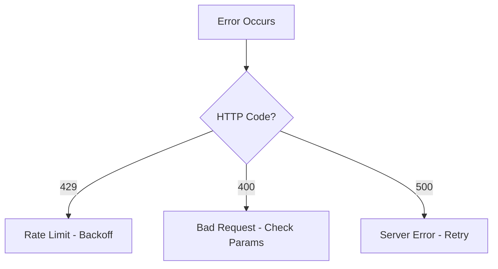

# CDF Troubleshooting Guide

## Common API Errors

- 429 Rate Limit: Implement backoff.

## Error Handling Patterns

```python
try:
    client.assets.create(asset)
except CogniteAPIError as e:
    logger.error(e)
```

## Transformation Debugging

Steps to inspect failed jobs.

### Error Decision Tree


