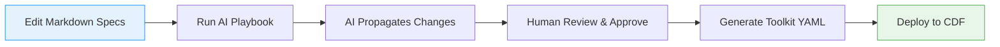

# Docs-as-Code Framework

## What is Docs-as-Code?

Docs-as-Code is an approach that treats documentation as software code—stored in
version control, collaboratively edited, and integrated into development
pipelines. In this framework, Markdown files become the single source of truth
for project designs, requirements, and specifications. Changes to docs trigger
automated workflows, much like code commits trigger builds.

Unlike traditional documentation (e.g., siloed Word docs or wikis), docs-as-code
ensures traceability, automation, and alignment with tools like Git and CI/CD.
In our CDF context, it means defining data models, security, and configurations
in readable Markdown, then using AI to generate deployable Cognite Toolkit YAML.

## Traditional vs. Docs-as-Code

| Aspect | Traditional Docs | Docs-as-Code |
|--------|------------------|--------------| | **Storage** | Separate tools
(e.g., Confluence) | Same repo as code (Git) | | **Versioning** | Manual
snapshots | Git history and branches | | **Collaboration** | Comments/emails |
Pull requests and reviews | | **Automation** | Limited | AI-driven updates and
generation | | **CDF Integration** | Manual translation | Direct to Toolkit YAML
|

This shift reduces errors and speeds up iterations—key for complex CDF projects.

## Benefits in CDF Projects

- **Accessibility**: Non-technical stakeholders can contribute via simple
  Markdown, while AI handles technical translation.
- **Automation**: Changes propagate automatically (e.g., update a template, AI
  syncs YAML), saving hours on manual config.
- **Version Control**: Track every design decision like code, enabling audits
  and rollbacks.
- **Scalability**: Modular structure supports growing projects without chaos.
- **Efficiency**: Integrates with Cognite SDK for validation and Toolkit for
  deployment, cutting setup time by 50%+.

For ROI details, see
[ROI Taxonomy](../../ai_knowledge/includes/roi_taxonomy.md).

## High-Level Workflow

This mirrors our Vision: Markdown drives AI-assisted generation with human
oversight. See [Workflow Lifecycle](workflow_lifecycle.md) for details.

## Getting Started

1. **Set Up Your Environment**: Clone the repo and install dependencies (see
   repo README).
1. **Choose a Template**: Start with
   [Project Design Principles](../templates/00_Solution_Design_Principles.md).
1. **Fill and Commit**: Replace placeholders, add details, and commit changes.
1. **Run a Playbook**: Use
   [Project Level Update](../ai_playbooks/01_PROJECT_LEVEL_UPDATE.md) to
   generate YAML.
1. **Review and Deploy**: Check outputs, then use Toolkit to apply.

**Tip**: For your first try, bootstrap a small module with
[Module Bootstrap](../ai_playbooks/02_MODULE_BOOTSTRAP.md).

> **Vision Tie-in**: This framework realizes our docs-as-code Vision by making
> Markdown the authoritative source, with AI enabling seamless propagation,
> review, and generation—empowering natural language management of CDF projects.

For templates, see [Templates Concept](templates.md). For operational flows,
jump to [Playbooks Concept](playbooks.md).
