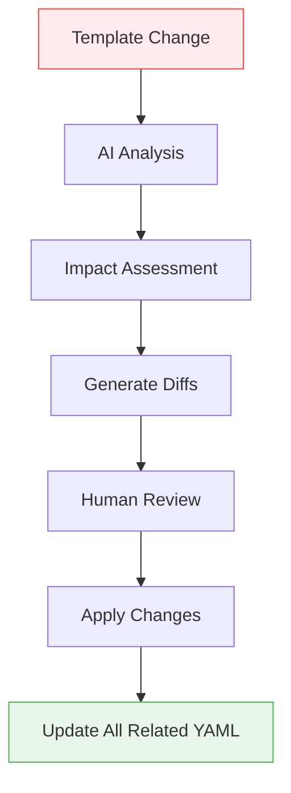
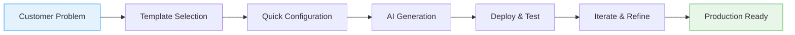
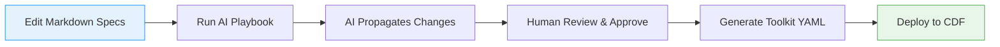

# Docs-as-Code Framework

## What is Docs-as-Code?

Docs-as-Code is an approach that treats documentation as software code—stored in
version control, collaboratively edited, and integrated into development
pipelines. In this framework, Markdown files become the single source of truth
for project designs, requirements, and specifications. Changes to docs trigger
automated workflows, much like code commits trigger builds.

Unlike traditional documentation (e.g., siloed Word docs or wikis), docs-as-code
ensures traceability, automation, and alignment with tools like Git and CI/CD.
In our CDF context, it means defining data models, security, and configurations
in readable Markdown, then using AI to generate deployable Cognite Toolkit YAML.

## Why Terraform IaC Succeeded (And How We Apply It)

Terraform revolutionized infrastructure management by solving fundamental
problems that plagued traditional approaches. We apply these same principles to
CDF project management:

### 1. **Declarative vs. Imperative Configuration**

**Terraform's Success**: Instead of writing scripts that describe *how* to
create infrastructure, you declare *what* you want the final state to be.

**Our Application**: Instead of manually writing Cognite Toolkit YAML or Python
SDK calls, you declare your desired CDF project state in Markdown:

```markdown
# Instead of writing complex YAML...
- **Space External ID:** `sp_well_performance`
- **Data Model:** `WellPerformanceModel v1`
- **Assets:** `Well`, `Pump`, `Sensor`
```

**Generated YAML**:

```yaml
# datamodels/well_performance.model.yaml
externalId: WellPerformanceModel
version: v1
space: sp_well_performance
views:
  - externalId: Well
    space: sp_well_performance
    version: v1
  - externalId: Pump
    space: sp_well_performance
    version: v1
```

### 2. **State Management & Drift Detection**

**Terraform's Success**: Tracks the actual state of infrastructure and detects
when reality differs from the declared state.

**Our Application**: AI playbooks track template changes and propagate them
across all affected YAML files, ensuring consistency:



### 3. **Resource Dependencies & Orchestration**

**Terraform's Success**: Automatically resolves dependencies between resources
(e.g., create VPC before subnet).

**Our Application**: AI understands CDF object relationships and generates
proper references:

```markdown
# Object Specification
- **Relationship:**
  - **Target:** `Well` (from Well.view.yaml)
  - **Type:** `direct`
  - **Multiplicity:** `1:N`
```

**Generated YAML**:

```yaml
# datamodels/pump.view.yaml
properties:
  well:
    type: direct
    source:
      type: view
      space: sp_well_performance
      externalId: Well
      version: v1
```

### 4. **Modularity & Reusability**

**Terraform's Success**: Modules allow packaging and reusing infrastructure
components.

**Our Application**: Template libraries enable rapid project bootstrapping:

```markdown
# Reusable Template Pattern
- **Import from Space:** `cdf_cdm`
  - **Models:** `CogniteAsset v1`, `CogniteEvent v1`
- **Extend with:** `WellPerformancePattern`
```

## CDF Toolkit Integration

Our framework generates YAML that works seamlessly with Cognite's recommended
CI/CD practices:

### Generated YAML Structure

```
quickstart_project/
├── config.dev.yaml              # Environment configuration
├── accessgroups/                # Security definitions
│   ├── admin.group.yaml         # Admin access
│   └── user.group.yaml          # User access
├── datasets/                    # Data organization
│   ├── raw_data.dataset.yaml    # Source data
│   └── processed.dataset.yaml   # Processed data
├── datamodels/                  # Data model definitions
│   ├── project_model.model.yaml # Main data model
│   └── views/                   # Business objects
│       ├── well.view.yaml       # Well definition
│       └── sensor.view.yaml     # Sensor definition
├── raw/                         # Source system configs
│   └── source_system.database.yaml
└── transformations/             # Data processing
    └── etl_pipeline.yaml
```

### CI/CD Pipeline Integration

```yaml
# .github/workflows/deploy.yml
name: Deploy CDF Project
on:
  push:
    branches: [main]
jobs:
  deploy:
    runs-on: ubuntu-latest
    steps:
      - uses: actions/checkout@v3
      - name: Deploy with Toolkit
        run: |
          cognite-toolkit deploy --env dev
          cognite-toolkit deploy --env prod
```

## Quickstart Acceleration: From PoC to Production

The docs-as-code approach dramatically accelerates customer PoCs (Quickstarts)
by providing:

### 1. **Rapid Project Bootstrap**

**Traditional Approach**: 2-3 weeks to set up basic CDF project

- Manual YAML creation
- Trial-and-error configuration
- Security setup complexity

**Our Approach**: 2-3 days to production-ready project

- Template-driven setup
- AI-generated configurations
- Pre-validated patterns

### 2. **Iterative Business Problem Solving**



**Example Quickstart Flow**:

1. **Day 1**: Customer describes well performance monitoring need
1. **Day 2**: Fill out templates, AI generates complete YAML
1. **Day 3**: Deploy to CDF, validate with sample data
1. **Day 4**: Iterate based on feedback, refine models
1. **Day 5**: Production deployment

### 3. **Template Libraries for Common Patterns**

**Industry-Specific Templates**:

- **Oil & Gas**: Well performance, equipment monitoring
- **Manufacturing**: Production lines, quality control
- **Utilities**: Grid monitoring, asset management

**Use Case Templates**:

- **Predictive Maintenance**: Asset + sensor + time series patterns
- **Quality Control**: Process + measurement + alert patterns
- **Energy Management**: Consumption + efficiency + reporting patterns

### 4. **Python SDK Integration**

Our generated YAML works seamlessly with the Cognite Python SDK:

```python
# Generated from templates
from cognite.client import CogniteClient
from cognite.client.data_classes.data_modeling import DataModelApply

# AI-generated SDK code based on templates
client = CogniteClient()

# Deploy data model
data_model = DataModelApply.load("datamodels/project_model.model.yaml")
client.data_modeling.data_models.apply(data_model)

# Query using generated views
wells = client.data_modeling.instances.list(
    view=("sp_well_performance", "Well", "v1"),
    limit=10
)
```

## Traditional vs. Docs-as-Code

| Aspect | Traditional Docs | Docs-as-Code |
|--------|------------------|--------------| | **Storage** | Separate tools
(e.g., Confluence) | Same repo as code (Git) | | **Versioning** | Manual
snapshots | Git history and branches | | **Collaboration** | Comments/emails |
Pull requests and reviews | | **Automation** | Limited | AI-driven updates and
generation | | **CDF Integration** | Manual translation | Direct to Toolkit YAML
| | **Quickstart Time** | 2-3 weeks | 2-3 days | | **Iteration Speed** | Days
per change | Hours per change | | **Error Reduction** | Manual validation |
Automated validation |

This shift reduces errors and speeds up iterations—key for complex CDF projects
and rapid customer PoCs.

## Benefits in CDF Projects

- **Accessibility**: Non-technical stakeholders can contribute via simple
  Markdown, while AI handles technical translation.
- **Automation**: Changes propagate automatically (e.g., update a template, AI
  syncs YAML), saving hours on manual config.
- **Version Control**: Track every design decision like code, enabling audits
  and rollbacks.
- **Scalability**: Modular structure supports growing projects without chaos.
- **Efficiency**: Integrates with Cognite SDK for validation and Toolkit for
  deployment, cutting setup time by 50%+.
- **Quickstart Acceleration**: Transform customer PoCs from weeks to days with
  template-driven approaches.
- **Business Focus**: Teams focus on solving business problems rather than
  technical configuration details.

For ROI details, see
[ROI Taxonomy](../../ai_knowledge/includes/roi_taxonomy.md).

## High-Level Workflow



This mirrors our Vision: Markdown drives AI-assisted generation with human
oversight. See [Workflow Lifecycle](workflow_lifecycle.md) for details.

## Getting Started

1. **Set Up Your Environment**: Clone the repo and install dependencies (see
   repo README).
1. **Choose a Template**: Start with
   [Project Design Principles](../templates/00_Solution_Design_Principles.md).
1. **Fill and Commit**: Replace placeholders, add details, and commit changes.
1. **Run a Playbook**: Use
   [Project Level Update](../ai_playbooks/01_PROJECT_LEVEL_UPDATE.md) to
   generate YAML.
1. **Review and Deploy**: Check outputs, then use Toolkit to apply.

**Tip**: For your first try, bootstrap a small module with
[Module Bootstrap](../ai_playbooks/02_MODULE_BOOTSTRAP.md).

> **Vision Tie-in**: This framework realizes our docs-as-code Vision by making
> Markdown the authoritative source, with AI enabling seamless propagation,
> review, and generation—empowering natural language management of CDF projects.

For templates, see [Templates Concept](templates.md). For operational flows,
jump to [Playbooks Concept](playbooks.md).
