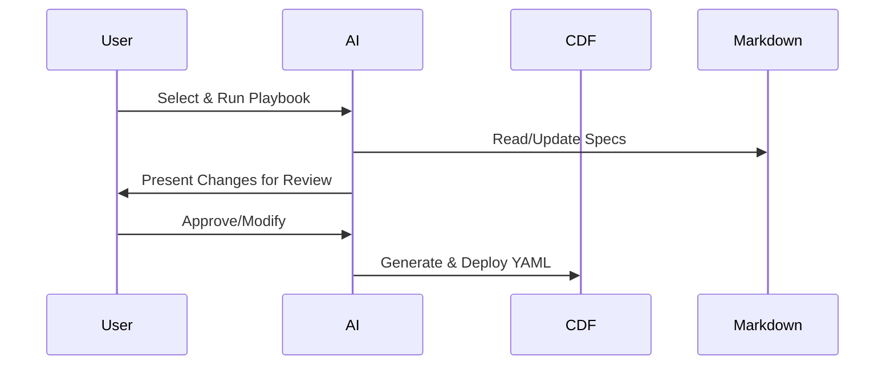

# Playbooks Concept

Playbooks are the operational core of the docs-as-code framework, providing
scripted workflows that leverage AI to manage CDF projects efficiently. They
embody our Vision by automating the translation from Markdown specifications to
actionable changes, with built-in human review. For the full Vision, see
[Overview](../overview.md).

## Role in Workflow

Playbooks orchestrate AI-driven tasks, from updating specifications to
generating YAML. They ensure consistency by propagating changes across tiers and
integrating with Cognite tools.

Key roles:

- Automate repetitive processes.
- Enforce standards via guided steps.
- Facilitate human-AI collaboration.
- Bridge design to deployment.

See [Workflow Lifecycle](workflow_lifecycle.md) for integration details.

## Catalogue Overview

Our 11 playbooks cover the full project lifecycle:

- [01_PROJECT_LEVEL_UPDATE](../ai_playbooks/01_PROJECT_LEVEL_UPDATE.md): Global
  project updates.
- [02_MODULE_BOOTSTRAP](../ai_playbooks/02_MODULE_BOOTSTRAP.md): New module
  initialization.
- [03_OBJECT_LEVEL_UPDATE](../ai_playbooks/03_OBJECT_LEVEL_UPDATE.md): Single
  object modifications.
- [04_SANITY_CHECK](../ai_playbooks/04_SANITY_CHECK.md): Validation checks.
- [05_TOOLKIT_YAML_SYNC](../ai_playbooks/05_TOOLKIT_YAML_SYNC.md): YAML
  generation.
- [06_ENVIRONMENT_PROMOTION](../ai_playbooks/06_ENVIRONMENT_PROMOTION.md): Env
  promotion.
- [07_CI_CD_PIPELINE](../ai_playbooks/07_CI_CD_PIPELINE.md): CI/CD setup.
- [08_DATA_INGESTION_OPERATIONS](../ai_playbooks/08_DATA_INGESTION_OPERATIONS.md):
  Data ingestion.
- [09_DATA_QUALITY_VALIDATION](../ai_playbooks/09_DATA_QUALITY_VALIDATION.md):
  DQ validation.
- [10_OBSERVABILITY_AND_ALERTING](../ai_playbooks/10_OBSERVABILITY_AND_ALERTING.md):
  Monitoring/alerts.
- [11_DEPRECATION_AND_CLEANUP](../ai_playbooks/11_DEPRECATION_AND_CLEANUP.md):
  Cleanup processes.

## Detailed Playbook Guides

### 01: Project Level Update

- **Purpose**: Manages updates to project-wide elements like design principles
  and environments.
- **Key Steps**: Parse changes, generate JSON, create YAML configs.
- **How to Use**: Edit Tier 1 template, merge PR to trigger.
- **Importance**: Ensures foundational consistency; integrates with Toolkit for
  YAML configs and SDK for validation.
- **Example**: Updating admin groups across envs.
- **Link**: [View Playbook](../ai_playbooks/01_PROJECT_LEVEL_UPDATE.md)

### 02: Module Bootstrap

- **Purpose**: Sets up new modules with directory structure and initial models.
- **Key Steps**: Create folders, clone templates, pre-fill objects.
- **How to Use**: Provide module name/objects, run manually.
- **Importance**: Supports modular Data Models; aligns with Toolkit for scalable
  deployments.
- **Example**: Creating "pump_analytics" module.
- **Link**: [View Playbook](../ai_playbooks/02_MODULE_BOOTSTRAP.md)

### 03: Object Level Update

- **Purpose**: Regenerates configs for a single updated object spec.
- **Key Steps**: Identify change, parse spec, patch YAML.
- **How to Use**: Merge object spec PR to trigger.
- **Importance**: Enables incremental updates; uses SDK for instance management.
- **Example**: Adding property to "pump" object.
- **Link**: [View Playbook](../ai_playbooks/03_OBJECT_LEVEL_UPDATE.md)

### 04: Sanity Check

- **Purpose**: Validates consistency across all specifications.
- **Key Steps**: Check placeholders, relationships, standards.
- **How to Use**: Run before sync or in CI.
- **Importance**: Prevents errors in Data Models; ties to Toolkit validation.
- **Example**: Detecting missing external IDs.
- **Link**: [View Playbook](../ai_playbooks/04_SANITY_CHECK.md)

### 05: Toolkit YAML Sync

- **Purpose**: Generates full Toolkit YAML from knowledge base.
- **Key Steps**: Load specs, translate to YAML, create report.
- **How to Use**: Run after validation.
- **Importance**: Core to Vision; produces deployable configs for Toolkit.
- **Example**: Syncing after project update.
- **Link**: [View Playbook](../ai_playbooks/05_TOOLKIT_YAML_SYNC.md)

### 06: Environment Promotion

- **Purpose**: Promotes configs between environments (e.g., dev to prod).
- **Key Steps**: Generate diff, review plan, apply changes.
- **How to Use**: Manual run by manager.
- **Importance**: Ensures safe deployments; integrates with Toolkit CLI.
- **Example**: Promoting validated YAML to prod.
- **Link**: [View Playbook](../ai_playbooks/06_ENVIRONMENT_PROMOTION.md)

### 07: CI/CD Pipeline

- **Purpose**: Automates validation and deployment workflows.
- **Key Steps**: Set up GH Actions, integrate playbooks.
- **How to Use**: Configure in repo.
- **Importance**: Scales Vision for teams; uses Toolkit in pipelines.
- **Example**: Auto-deploy on merge.
- **Link**: [View Playbook](../ai_playbooks/07_CI_CD_PIPELINE.md)

### 08: Data Ingestion Operations

- **Purpose**: Manages data loading into CDF.
- **Key Steps**: Define sources, transformations, schedules.
- **How to Use**: Configure ingestion jobs.
- **Importance**: Populates Data Models; leverages SDK for batch ops.
- **Example**: Ingesting sensor data.
- **Link**: [View Playbook](../ai_playbooks/08_DATA_INGESTION_OPERATIONS.md)

### 09: Data Quality Validation

- **Purpose**: Ensures ingested data meets standards.
- **Key Steps**: Define checks, run validations.
- **How to Use**: Integrate post-ingestion.
- **Importance**: Maintains Data Model integrity; uses SDK queries.
- **Example**: Validating time series completeness.
- **Link**: [View Playbook](../ai_playbooks/09_DATA_QUALITY_VALIDATION.md)

### 10: Observability and Alerting

- **Purpose**: Sets up monitoring for CDF resources.
- **Key Steps**: Define metrics, configure alerts.
- **How to Use**: Implement dashboards.
- **Importance**: Monitors deployments; ties to Toolkit for health checks.
- **Example**: Alerting on failed transformations.
- **Link**: [View Playbook](../ai_playbooks/10_OBSERVABILITY_AND_ALERTING.md)

### 11: Deprecation and Cleanup

- **Purpose**: Safely removes obsolete resources.
- **Key Steps**: Mark deprecated, analyze impact, remove.
- **How to Use**: Follow four-step process.
- **Importance**: Reduces costs; maintains clean Data Models.
- **Example**: Deprecating legacy view.
- **Link**: [View Playbook](../ai_playbooks/11_DEPRECATION_AND_CLEANUP.md)

## Running a Playbook

General steps for any playbook:

1. Select the appropriate playbook file.
1. Provide any required inputs (e.g., changed files).
1. Execute via AI agent or script.
1. Review generated outputs and approve.
1. Merge changes.

Always include human review for quality.

## Customization

- Modify steps to fit your project.
- Add custom validation checks.
- Integrate with tools like Git hooks.

## Best Practices

- **Selection**: Match playbook to task (e.g., use 05 for sync).
- **Integration**: Chain playbooks (e.g., 04 before 05).
- **Documentation**: Add notes on customizations.
- **Testing**: Run in dev first.
- **Links**: See [Templates](templates.md) for inputs;
  [CI/CD Advanced](../advanced/ci_cd.md) for automation.
