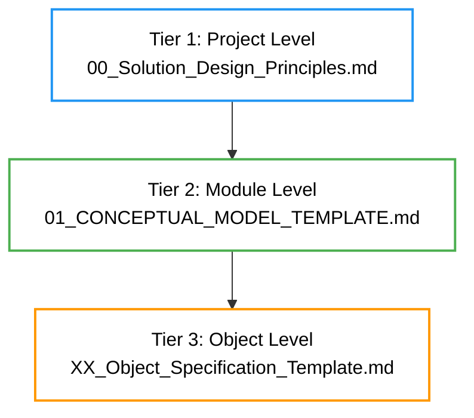

# Templates Concept

Templates form the foundation of the docs-as-code approach, providing structured
Markdown documents to capture business requirements and technical designs
systematically. They align directly with our Vision by serving as the
human-readable source of truth that drives AI-assisted workflows and YAML
generation. For the full Vision, see [Overview](../overview.md).

## Role in Workflow

In the docs-as-code lifecycle, templates serve as the entry point for defining
project elements. They act as human-readable specifications that AI playbooks
use to generate or update CDF configurations.

Key roles:

- Capture initial requirements in natural language.
- Enable AI-assisted propagation of changes.
- Serve as version-controlled source of truth.
- Facilitate collaboration between teams.

For more on how templates fit into the full process, see
[Workflow Lifecycle](workflow_lifecycle.md).

## Tiered Structure

Templates are organized in a three-tier hierarchy to match project complexity:



- **Tier 1 (Project Level)**: Global principles, environments, and standards.
  Defines the overall project scope.
- **Tier 2 (Module Level)**: Conceptual models for specific modules (e.g., well
  performance).
- **Tier 3 (Object Level)**: Detailed specifications for individual objects
  within modules.

This structure ensures scalability: Changes at higher tiers cascade down,
maintaining consistency.

## Detailed Template Guides

### Tier 1: Project Design Principles

- **Purpose**: Sets the project's global foundation, including naming,
  environments, datasets, and security. It's the starting point for all designs,
  ensuring alignment with Cognite's ecosystem (e.g., spaces for Data Models,
  auth for SDK/Toolkit).

- **Key Sections**:

  - Project Overview: Goals, use cases (e.g., "Monitor well performance").
  - Environments: Dev/prod configs.
  - Data Sets: Storage definitions.
  - Standards: Rules for consistency.

- **How to Use**:

  1. Open [the template](../templates/00_Solution_Design_Principles.md).
  1. Fill placeholders (e.g., ${PROJECT_NAME}).
  1. Use SDK to test (e.g., client.data_sets.list()).
  1. Run Toolkit deploy for YAML validation.

- **Importance**: Defines spaces/containers for Data Models; configures security
  for SDK access; generates Toolkit YAML for deployments. Essential for
  scalable, secure CDF projects.

- **Example**:

  ```
  - **Project Name:** WellMonitoring
  - **Environments:** dev, prod
  ```

- **Link**: [View Template](../templates/00_Solution_Design_Principles.md)

### Tier 2: Conceptual Model Template

- **Purpose**: Outlines module-level objects, relationships, and integrations.
  Maps business concepts to Cognite Data Model elements like views/containers.

- **Key Sections**:

  - Core Objects: Entities (e.g., "Well" as Asset).
  - Relationships: Connections with attributes.
  - External References: Links to other models.
  - Module Data Model: Groups views.

- **How to Use**:

  1. Reference Tier 1 standards.
  1. List objects/relationships.
  1. Use SDK: client.data_modeling.views.create().
  1. Validate with Toolkit YAML dry-run.

- **Importance**: Builds reusable Data Models; enables SDK queries; structures
  Toolkit modules for deployment.

- **Example**:

  ```
  - **Object:** Well
    - **Type:** Physical Asset
  - **Relationship:** WorkOrder -> Well
    - **Type:** direct
  ```

- **Link**: [View Template](../templates/01_CONCEPTUAL_MODEL_TEMPLATE.md)

### Tier 3: Object Specification Template

- **Purpose**: Details object properties, relationships, and views. Translates
  to Cognite instances for data population.

- **Key Sections**:

  - Properties: Fields/types (e.g., "flowRate: float").
  - Relationships: Attributes.
  - View Configuration: Implements/requires.

- **How to Use**:

  1. Align with Tier 2 models.
  1. Specify details.
  1. Use SDK: client.data_modeling.instances.apply().
  1. Deploy via Toolkit.

- **Importance**: Creates queryable Data Model instances; optimizes SDK
  performance; customizes Toolkit YAML.

- **Example**:

  ```
  - **Property:** pressure
    - **Type:** float
    - **Source:** Time Series
  ```

- **Link**: [View Template](../templates/XX_Object_Specification_Template.md)

## Filling Placeholders

Templates use placeholders like `${PROJECT_NAME}` for customization.

**Step-by-Step Guide**:

1. **Copy the Template**: Duplicate to your working directory.
1. **Replace Placeholders**: Use project-specific values (e.g.,
   `${PROJECT_NAME}` → "IndustrialIoTPlatform").
1. **Add Details**: Include descriptions and rationale for choices.
1. **Validate**: Use AI playbooks to check consistency.

**Example** from
[Solution Design Principles](../templates/00_Solution_Design_Principles.md):

```
Original: `${PROJECT_NAME}`
Filled: "IndustrialIoTPlatform"
```

**Tip**: Document your choices—e.g., "Chosen for scalability reasons"—to improve
AI understanding during propagation.

For module-level example, see
[Conceptual Model Template](../templates/01_CONCEPTUAL_MODEL_TEMPLATE.md).

## Best Practices

- **Consistency**: Use snake_case for external IDs; document all decisions with
  rationale.
- **Completeness**: Fill all sections; add comments for clarity (e.g., why a
  property is required).
- **Versioning**: Commit changes with meaningful messages like "Updated Tier 1
  for new security rules."
- **Integration**: Reference higher-tier templates in lower ones (e.g., cite
  global standards in object specs).
- **Validation**: Run sanity check playbooks after filling.
- **Examples**: Start with small projects; scale by duplicating Tier 2/3
  templates.
- **Links**:
  - Global:
    [Project Design Principles](../templates/00_Solution_Design_Principles.md)
  - Module: [Conceptual Model](../templates/01_CONCEPTUAL_MODEL_TEMPLATE.md)
  - Object:
    [Object Specification](../templates/XX_Object_Specification_Template.md)

For customization tips, see [Playbooks Concept](playbooks.md).
