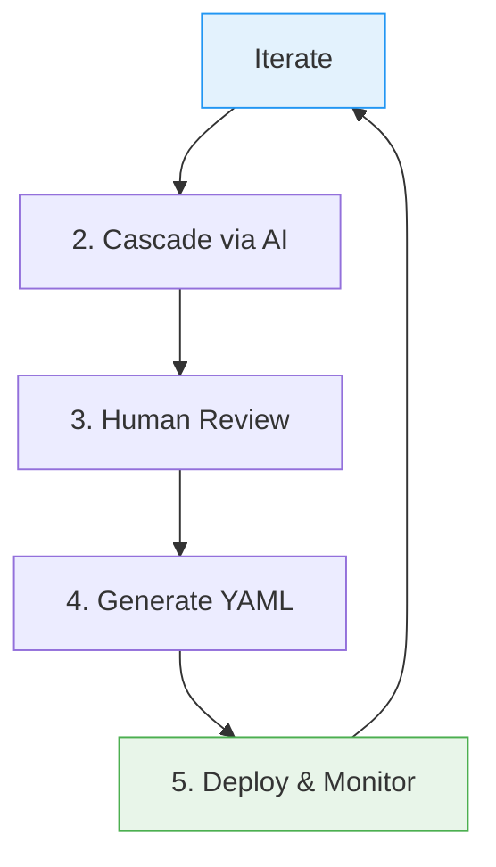

# Workflow Lifecycle

The workflow lifecycle outlines the end-to-end process of managing a CDF project
using docs-as-code. It builds on the conceptual foundation in
[Docs-as-Code Framework](docs_as_code.md), providing a practical sequence from
design to deployment. This lifecycle emphasizes our Vision's AI-driven cascade,
human review, and automated YAML generation.

## Full Lifecycle

The lifecycle consists of five iterative phases, repeatable for updates:

1. **Design in Templates**: Define requirements using tiered Markdown templates.
1. **Cascade Changes via AI**: Use playbooks to propagate updates automatically.
1. **Review Modifications**: Human validation of AI-generated changes.
1. **Generate YAML**: Convert approved specs to Toolkit configurations.
1. **Deploy and Monitor**: Apply to CDF and observe.

### Phase Details with Examples

- **Phase 1: Design**: Edit templates (e.g., add a property in Tier 3). Example:
  In `XX_Object_Specification_Template.md`, define "flowRate" for a "Pump"
  object. Ties to [Templates Concept](templates.md).
- **Phase 2: Cascade**: Run a playbook like
  [Object Level Update](../ai_playbooks/03_OBJECT_LEVEL_UPDATE.md). AI updates
  related views/containers.
- **Phase 3: Review**: Check diffs in PR; approve or adjust. Ensures human
  oversight per Vision.
- **Phase 4: Generate**: Execute
  [Toolkit YAML Sync](../ai_playbooks/05_TOOLKIT_YAML_SYNC.md) to produce YAML
  files.
- **Phase 5: Deploy & Monitor**: Use
  [Environment Promotion](../ai_playbooks/06_ENVIRONMENT_PROMOTION.md) and
  [Observability](../ai_playbooks/10_OBSERVABILITY_AND_ALERTING.md). Example:
  Deploy to prod and set alerts.

## Tools Integration

- **Git**: Version control for templates (e.g., branch for changes).
- **Cursor/AI Agents**: Run playbooks for cascade/generation.
- **Cognite SDK**: Validate designs (e.g., test queries).
- **CDF Toolkit**: Deploy YAML (e.g., `cdf-tk apply`).
- **CI/CD**: Automate via
  [CI/CD Pipeline](../ai_playbooks/07_CI_CD_PIPELINE.md).

Example: Integrate Git hooks to run
[Sanity Check](../ai_playbooks/04_SANITY_CHECK.md) on commit.

## Scaling to Multi-Module

For larger projects:

- **Modular Design**: Use
  [Module Bootstrap](../ai_playbooks/02_MODULE_BOOTSTRAP.md) for independent
  modules.
- **Cross-Module Cascade**: AI handles dependencies (e.g., shared objects
  trigger updates).
- **Human Review at Scale**: Use diffs and reports for efficient oversight.
- **Best Practices**: Limit modules to 10-15; use
  [Deprecation and Cleanup](../ai_playbooks/11_DEPRECATION_AND_CLEANUP.md) to
  prune.

This scales the Vision: AI manages complexity, humans focus on decisions.

## Best Practices & Tips

- **Iteration**: Treat the lifecycle as a loop—monitor and redesign as needed.
- **Error Prevention**: Always run
  [Sanity Check](../ai_playbooks/04_SANITY_CHECK.md) before generation.
- **Documentation**: Log changes in commit messages.
- **Common Pitfalls**: Avoid skipping reviews; test in dev first.

For starting points, see [Getting Started in Docs-as-Code](docs_as_code.md).
Explore playbooks in [Playbooks Concept](playbooks.md).
