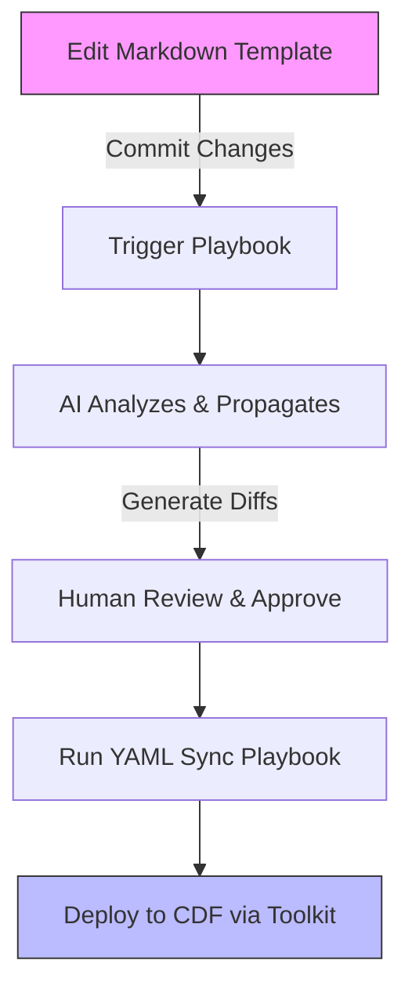

# CDF Docs-as-Code Overview

## Vision Summary

The goal is to establish a docs-as-code framework where human-readable Markdown
documents serve as the single source of truth for a Cognite Data Fusion (CDF)
project. This approach abstracts away the complexity of Cognite Toolkit YAML,
allowing architects and engineers to define business requirements and technical
designs in plain English.
    <!-- For the authoritative Vision, see [TODO.md](../../TODO.md) in the repo root. -->

The intended workflow is:

1. **Design in Markdown**: Define high-level project scope, data models, and
   security rules in templated Markdown files.
1. **AI-Driven Cascade**: Use playbooks to propagate changes via AI agents to
   affected documents.
1. **Human-in-the-Loop Review**: Review and approve AI-generated changes.
1. **YAML Generation**: Generate or patch Cognite Toolkit YAML for deployment.

## Benefits of Docs-as-Code Approach

- **Accessibility**: Write requirements in natural language, accessible to
  non-technical stakeholders who can contribute directly (e.g., business
  analysts editing templates).
- **Automation**: AI handles propagation and generation, reducing manual errors
  (e.g., saves 50%+ time on config updates via automated YAML sync).
- **Version Control**: Track changes to designs like code, enabling audits and
  rollbacks.
- **Efficiency**: Streamline from requirements to deployment, with faster
  onboarding through English docs instead of code (e.g., new team members grasp
  projects in hours, not days).
- **Knowledge Transfer**: Centralized, readable docs speed up team handovers and
  reduce miscommunications, with a few key documents as the go-to source of
  truth.

## Workflow Diagram

## Next Steps

- Explore the [Docs-as-Code Concept](concepts/docs_as_code.md) for fundamentals.
- Dive into [Templates Overview](concepts/templates.md) to start designing.
- Understand the full process in
  [Workflow Lifecycle](concepts/workflow_lifecycle.md).

[Back to Home](/index.md) | [Related: Playbooks Concept](concepts/playbooks.md)
