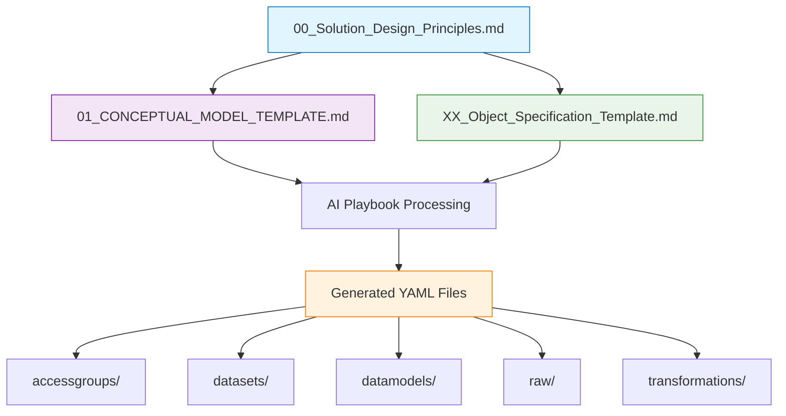
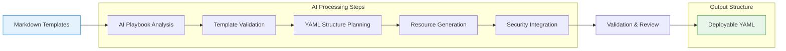
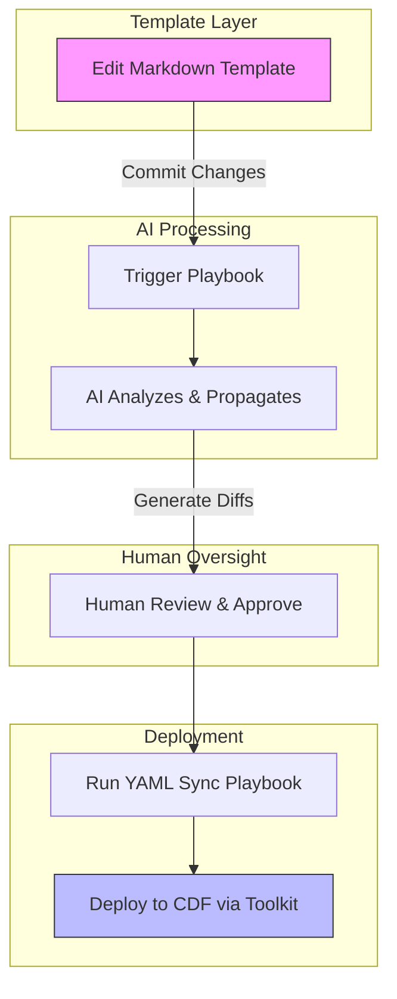

# CDF Docs-as-Code Overview

## Vision Summary

The goal is to establish a docs-as-code framework where human-readable Markdown
documents serve as the single source of truth for a Cognite Data Fusion (CDF)
project. This approach abstracts away the complexity of Cognite Toolkit YAML,
allowing architects and engineers to define business requirements and technical
designs in plain English.

**Inspired by Terraform's Infrastructure-as-Code (IaC) paradigm**, we apply the
same principles to CDF project management: declarative specifications in
human-readable format that generate complex, consistent infrastructure
configurations.

The intended workflow is:

1. **Design in Markdown**: Define high-level project scope, data models, and
   security rules in templated Markdown files.
1. **AI-Driven Cascade**: Use playbooks to propagate changes via AI agents to
   affected documents.
1. **Human-in-the-Loop Review**: Review and approve AI-generated changes.
1. **YAML Generation**: Generate or patch Cognite Toolkit YAML for deployment.

## Benefits of Docs-as-Code Approach

- **Accessibility**: Write requirements in natural language, accessible to
  non-technical stakeholders who can contribute directly (e.g., business
  analysts editing templates).
- **Automation**: AI handles propagation and generation, reducing manual errors
  (e.g., saves 50%+ time on config updates via automated YAML sync).
- **Version Control**: Track changes to designs like code, enabling audits and
  rollbacks.
- **Efficiency**: Streamline from requirements to deployment, with faster
  onboarding through English docs instead of code (e.g., new team members grasp
  projects in hours, not days).
- **Knowledge Transfer**: Centralized, readable docs speed up team handovers and
  reduce miscommunications, with a few key documents as the go-to source of
  truth.

## From Templates to YAML: The Generation Process

Our framework transforms high-level Markdown specifications into precise Cognite
Toolkit YAML configurations through a structured, AI-driven process.

### Core Template Hierarchy



### Template-to-YAML Mapping

| Template Component | Generated YAML | Purpose |
|-------------------|----------------|---------| | **Project Configuration**
(00_Solution_Design_Principles.md) | `config.[env].yaml` | Environment-specific
settings | | **Security Roles** | `accessgroups/*.group.yaml` | Access control
definitions | | **Data Sets** | `datasets/*.dataset.yaml` | Data organization
containers | | **Conceptual Models** (01_CONCEPTUAL_MODEL_TEMPLATE.md) |
`datamodels/*.model.yaml` | High-level data model structure | | **Object
Specifications** (XX_Object_Specification_Template.md) |
`datamodels/*.view.yaml` | Detailed object definitions | | **RAW Sources** |
`raw/*.database.yaml` | Source system configurations |

### YAML Generation Workflow



### Example: From Template to YAML

**Input: Solution Design Principles**

```markdown
- **Space External ID:** `sp_well_performance`
- **Data Set:**
  - **External ID:** `ds_well_data`
  - **Name:** `Well Performance Data`
```

**Generated YAML:**

```yaml
# datasets/well_data.dataset.yaml
externalId: ds_well_data
name: Well Performance Data
description: Well performance monitoring data
writeProtected: false
```

**Input: Object Specification**

```markdown
- **Property:**
  - **Name:** `wellName`
  - **Data Type:** `text`
  - **Source Field:** `WELL_ID`
```

**Generated YAML:**

```yaml
# datamodels/well.view.yaml
externalId: well_view
version: v1
properties:
  wellName:
    type: text
    nullable: false
    source:
      type: container
      container:
        externalId: well_container
      property: wellName
```

## Terraform IaC Inspiration

Like Terraform's approach to infrastructure management, our framework provides:

### Declarative Configuration

- **Terraform**: Define desired infrastructure state in `.tf` files
- **Our Framework**: Define desired CDF project state in Markdown templates

### State Management

- **Terraform**: Tracks infrastructure state, applies incremental changes
- **Our Framework**: Tracks project configuration state, propagates changes
  across templates

### Resource Dependencies

- **Terraform**: Automatically resolves resource dependencies
- **Our Framework**: AI resolves cross-template dependencies and generates
  proper YAML references

### Validation & Planning

- **Terraform**: `terraform plan` shows what will change
- **Our Framework**: AI playbooks show template changes and their YAML impact

## Workflow Diagram



## Module Structure Alignment

Our generated YAML follows Cognite Toolkit's recommended structure:

```
module_name/
├── config.dev.yaml          # Environment config
├── accessgroups/            # Security definitions
│   ├── admin.group.yaml
│   └── user.group.yaml
├── datasets/                # Data organization
│   └── source_data.dataset.yaml
├── datamodels/              # Data model definitions
│   ├── project_model.model.yaml
│   └── business_objects/
│       ├── well.view.yaml
│       └── workorder.view.yaml
├── raw/                     # Source system configs
│   └── sap_system.database.yaml
└── transformations/         # Data processing
    └── etl_pipeline.yaml
```

## Next Steps

- Explore the [Docs-as-Code Concept](concepts/docs_as_code.md) for fundamentals.
- Dive into [Templates Overview](concepts/templates.md) to start designing.
- Understand the full process in
  [Workflow Lifecycle](concepts/workflow_lifecycle.md).

[Back to Home](/index.md) | [Related: Playbooks Concept](concepts/playbooks.md)
