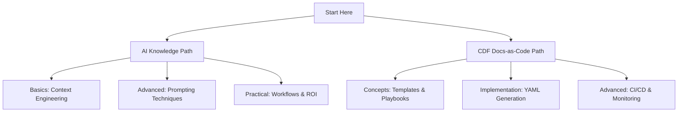

# AI-Assisted Development Knowledge Base

    <!-- Replace with actual banner if available -->

> Empowering developers with AI-assisted workflows and production-ready Cognite
> Data Fusion (CDF) frameworks. Build smarter, deploy faster.

Welcome to a comprehensive resource bridging AI-assisted development and CDF
project management. Built on a "docs-as-code" vision, this repo uses Markdown as
the source of truth, with AI driving automation and Toolkit YAML generation.

## Core Ideals of This Repository

- **AI + CDF Synergy**: Leverage AI for smarter workflows, combining prompt
  engineering with CDF's Data Models and Toolkit for efficient, scalable
  industrial solutions.
- **Docs-as-Code Philosophy**: Treat designs as code for versioned,
  collaborative management, enabling faster onboarding through natural language
  docs.
- **Practical Focus**: Real-world templates, playbooks, and metrics to deliver
  measurable value, like 50%+ efficiency gains in project setup.
- **Community Growth**: Evolve through contributions, ensuring cutting-edge
  content.

## 🎯 Why This Repository?

- **Dual Learning Paths**: From AI fundamentals to advanced CDF implementation.
- **Practical Value**: Production-tested templates, workflows, and ROI
  frameworks.
- **Efficiency Gains**: Reduce development time by 40-60% with AI patterns.
- **Community-Driven**: Contribute to evolving best practices.

## 📊 Dual Learning Paths

### 1. AI Knowledge Path

Master AI to supercharge your development.

- [Overview](ai_knowledge/index.md) – Core concepts.
- [Context Engineering](ai_knowledge/context_engineering.md) – Build effective
  AI context.
- [Advanced Prompting](ai_knowledge/advanced_prompting.md) – Sophisticated
  techniques.
- **Next**: Dive into [Workflows](ai_knowledge/ai_workflows/index.md).

### 2. CDF Docs-as-Code Path

Manage CDF projects with AI-assisted docs.

- [Overview & Vision](cdf_project/overview.md) – The big picture.
- [Core Concepts](cdf_project/concepts/docs_as_code.md) – Framework basics.
- [Templates](cdf_project/concepts/templates.md) – Design your project.
- **Next**: Explore [Playbooks](cdf_project/concepts/playbooks.md).

## 📁 Browse by Category

- **AI & Prompting**: [Fundamentals](ai_knowledge/prompt_techniques_overview.md)
  | [Advanced](ai_knowledge/advanced_prompting.md) |
  [Workflows](ai_knowledge/ai_workflows/index.md)
- **CDF Framework**: [Concepts](cdf_project/concepts/docs_as_code.md) |
  [Templates](cdf_project/templates/00_Solution_Design_Principles.md) |
  [Playbooks](cdf_project/ai_playbooks/01_PROJECT_LEVEL_UPDATE.md) |
  [Advanced](cdf_project/advanced/ci_cd.md)
- **Governance**: [Guidelines](GOVERNANCE.md) | [Contributing](contributing.md)

## 🔍 Common Use Cases

- **Learn AI Basics**: Dive into
  [Context Engineering](ai_knowledge/context_engineering.md).
- **Build CDF Models**: Use
  [Conceptual Model Template](cdf_project/templates/01_CONCEPTUAL_MODEL_TEMPLATE.md).
- **Automate Workflows**: Follow
  [Workflow Lifecycle](cdf_project/concepts/workflow_lifecycle.md).
- **Scale Projects**: Leverage multi-module designs for large datasets, using
  [Module Bootstrap](cdf_project/ai_playbooks/02_MODULE_BOOTSTRAP.md).
- **Measure ROI**: Apply [ROI Taxonomy](ai_knowledge/includes/roi_taxonomy.md).

## 🤝 Get Involved

See [Contributing](contributing.md) to add your expertise.

**Ready to transform your workflow?** Choose a path above or
[browse the full docs](site-map.md).
